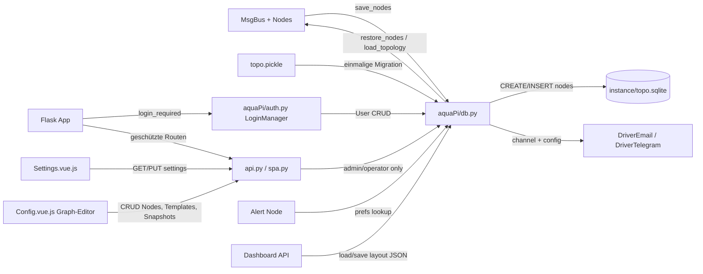
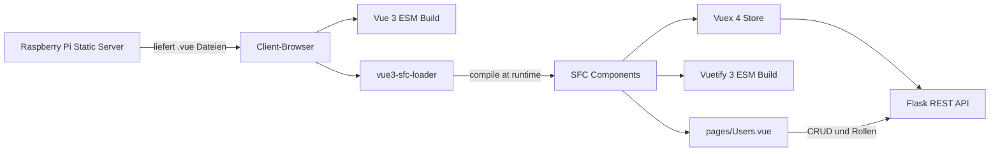

# Requirements

### Overview & Goals
Die Umstellung der aquaPi-Konfiguration/Topologie von unsicherem **Pickle** auf **SQLite** wird jetzt umgesetzt (vorheriger "Status Quo"-Beschluss wird aufgehoben). Ziel ist es, das Pickle-Deserialisierungs-Risiko (RCE) zu beseitigen und die Node-Topologie strukturierter, abfragbar und wartbarer zu speichern. **Zusätzlich** wird im selben Zug die **Authentifizierung** (Flask-Login) implementiert, da das Backend aktuell komplett ohne Zugriffskontrolle läuft (der bisherige Login im Frontend ist nur ein Mock) — beides nutzt dieselbe neue SQLite-Infrastruktur (`aquaPi/db.py`).

**Neu (dieser Abschnitt)**: Umsetzung der beiden noch als "Baustelle" markierten Seiten aus der `ToDo`-Liste:
*   **`/config`** (ToDo Zeile 23): Aktuell zeigt `Config.vue.js` nur eine flache, nicht editierbare Liste aller Bus-Nodes an ("Große Baustelle!"-Hinweis). Es soll eine GUI entstehen, mit der Nodes und ihre Verdrahtung (`receives`) grafisch angezeigt, per Drag&Drop positioniert, verbunden, hinzugefügt/entfernt/bearbeitet sowie als Konfiguration gespeichert/geladen werden können — inkl. Wiederverwendung von **Templates** für häufige Node-Kombinationen (ToDo Zeile 35-37).
*   **`/settings`** (ToDo Zeile 20-22): Aktuell zeigt `Settings.vue.js`/`AquapiSettings` nur einen Platzhalter-Hinweis. Es soll eine GUI entstehen, die alle Controller-Nodes in **faltbaren Gruppen** (`group`-Property) anzeigt und ihre Betriebsparameter (z.B. Setpoints) über passende Eingabe-Widgets (Regler/Slider, numerischer Input, Switch, Schedule-Editor) bearbeitbar macht — aufbauend auf dem bereits im Backend vorhandenen `get_settings()`-Mechanismus der Node-Klassen.

Beide Seiten bauen auf der in diesem Plan bereits vorgesehenen SQLite-Infrastruktur (`aquaPi/db.py`, `nodes`-Tabelle, Rollenmodell `viewer`/`operator`/`admin`) auf: `/settings`-Änderungen erfordern mindestens `operator`, strukturelle `/config`-Änderungen (Node hinzufügen/verbinden/löschen) erfordern `admin`, wie in ToDo Zeile 22 ("Edit needs auth") und Zeile 24 ("Allow authenticated users to add/change/remove nodes") gefordert.

**Erweiterung**: Zusätzlich werden die Telegram-/Mail-Benachrichtigungsparameter (aktuell in `config.json`, siehe `DriverText.py`) ebenfalls in die SQLite-DB überführt, mit **Benutzerzuordnung** (globale Zugangsdaten + pro-User konfigurierbarem Empfänger-Kanal je Alert). Weiterhin werden **benutzerspezifische Dashboards** (Layout/sichtbare Controller) in SQLite gespeichert, und Controller erhalten eine neue **`group`-Property** (ToDo Zeile 30) zur Gruppierung/Filterung sowohl im Dashboard als auch auf `/settings`. Schließlich werden alle REST-API-Antworten von `jsonpickle` auf reines **JSON** umgestellt.

### Scope
*   **In Scope**:
    *   Ablösung von `topo.pickle` (Node-Topologie) durch eine SQLite-Datenbank in `instance/`.
    *   Hybrides Schema: `nodes`-Tabelle (id, type, name, receives/verdrahtung) + JSON-Spalte (`params`) für node-spezifische Parameter, unter Nutzung der SQLite-JSON1-Funktionen.
    *   Einmaliges Migrationsskript, das eine bestehende `topo.pickle` automatisch in die neue SQLite-DB überführt.
    *   Anpassung von `MachineRoom.save_nodes()` / `restore_nodes()` in `aquaPi/machineroom/__init__.py` auf SQLite.
    *   **Neu**: Implementierung von **Flask-Login** zur Authentifizierung des Backends, inkl. `users`-Tabelle in derselben SQLite-DB (`instance/topo.sqlite` bzw. eigene `instance/users.sqlite`) für gehashte Zugangsdaten **und eine `role`-Spalte**.
    *   **Neu**: Drei Benutzerrollen gemäß `ToDo` (Zeile 62-63): **Viewer** (nur Lesezugriff/Anzeige), **Operator** (zusätzlich Sollwerte/Setpoints ändern), **Admin** (volle Konfiguration inkl. Nutzerverwaltung, Knoten-Verdrahtung).
    *   Anlegen eines ersten Admin-Users sowie Schutz der bestehenden API-Endpunkte (`/api/nodes/`, Einstellungen) hinter Login **und passender Rollenprüfung** (z.B. via `@roles_required('admin')`-Decorator).
    *   **Neu**: Migration der Telegram-/Mail-Parameter (`config.json`, `DriverText.py`) in eine SQLite-Tabelle `notification_config`, ergänzt um eine `user_notification_prefs`-Tabelle für die Zuordnung Alert→User→Kanal (globale Zugangsdaten, aber pro User wählbarer Empfänger je Alert).
    *   **Neu**: Benutzerspezifische Dashboards: Tabelle `dashboards` mit `user_id` und JSON-Spalte für Layout/sichtbare Controller/Gruppen.
    *   **Neu**: `group`-Property (TEXT, Default `""`) als neues Feld in der `nodes`-Tabelle (Teil des `params`-JSON oder eigene Spalte), nutzbar zur Gruppen-Filterung im Dashboard **und** für foldable Gruppen auf `/settings`.
    *   **Neu**: Umstellung aller REST-API-Antworten (`api.py`) von `jsonpickle.encode(..., unpicklable=False)` auf Standard-`json.dumps` mit expliziten, sauberen Dict-Strukturen statt Objekt-Introspektion.
        *   **Neu (Verbesserungsvorschläge)**: Self-Service-Passwort-Reset per E-Mail-Link, Login-Rate-Limiting/Lockout, Audit-Log für Konfigurations-/Setpoint-Änderungen, Backup/Export (inkl. automatisiertem Scheduling) der SQLite-DB, `/api/health`-Endpoint, i18n (Deutsch/Englisch via Vue-I18n), Dark-Mode-Theme, Mobile-/Responsive-Check, Graceful Degradation bei fehlender Internetverbindung, konfigurierbare Alarm-Eskalation, Sensor-Kalibrierungs-Historie sowie CSV/JSON-Export von QuestDB-Zeitreihen.
    *   **Neu**: `/settings`-Seite: Generisches Rendering von Eingabe-Widgets (Slider, Zahlenfeld, Switch, Schedule) je Controller-Node auf Basis der bestehenden `get_settings()`-Metadaten je Node-Klasse, gruppiert/faltbar nach der neuen `group`-Property; neue Schreib-Route `PUT /api/nodes/<node_id>/settings` (mind. Rolle `operator`).
    *   **Neu**: `/config`-Seite: Grafischer Node-Graph-Editor (Boxen + Verbindungslinien für `receives`), Drag&Drop-Positionierung (Koordinaten im `params`-JSON der `nodes`-Tabelle), Hinzufügen/Bearbeiten/Löschen/Verbinden von Nodes, Speichern/Laden ganzer Konfigurationen sowie ein einfaches Template-System für häufige Node-Kombinationen (nur Rolle `admin`).
*   **Out of Scope**:
    *   QuestDB-Integration für Zeitreihen (`hist_nodes.py`) — bleibt unverändert.
    *   Feingranulare Rechte pro einzelnem Node/Feld — es wird nur zwischen den drei Rollen unterschieden, keine Attribut-Level-Permissions.
    *   Ablösung des Frontend-Mock-Logins (`auth.js`) durch echte Session-Anbindung — wird in einem separaten Frontend-Schritt behandelt, sobald das Backend-Login steht (Rollen-Anzeige im UI ggf. als Folgeschritt).
    *   Drag&Drop-Dashboard-Editor im Frontend — nur die Backend-Persistenz (JSON-Blob je User) wird in diesem Zug umgesetzt, die Editier-UI ist ein Folgeschritt.

### User Stories
*   Als **Entwickler** möchte ich die Node-Konfiguration in einer strukturierten DB einsehen und debuggen können, statt eine binäre Pickle-Datei zu inspizieren.
*   Als **Betreiber** möchte ich, dass eine manipulierte Konfigurationsdatei keinen beliebigen Code mehr ausführen kann (kein Pickle-RCE-Risiko mehr).
*   Als **Nutzer** möchte ich, dass meine bestehende, per Pickle gespeicherte Konfiguration beim Umstieg automatisch übernommen wird, ohne dass ich alles neu einrichten muss.
*   Als **Betreiber** möchte ich, dass die Web-Oberfläche und die API nur nach Login zugänglich sind, damit nicht jeder im Netzwerk die Aquarien-Steuerung verändern kann.
*   Als **Admin** möchte ich mich mit Benutzername/Passwort anmelden können, wobei das Passwort sicher gehasht gespeichert wird.
*   Als **Viewer** möchte ich Messwerte und Status einsehen können, aber keine Einstellungen ändern dürfen.
*   Als **Operator** möchte ich Sollwerte (z.B. Temperatur-Setpoints) anpassen können, ohne Zugriff auf die volle Systemkonfiguration oder Nutzerverwaltung zu haben.
*   Als **Admin** möchte ich Benutzer anlegen, Rollen zuweisen und die komplette Knoten-Konfiguration ändern können.
*   Als **Nutzer** möchte ich für einzelne Alerts festlegen können, ob und wohin (mein Telegram-Chat/meine E-Mail) ich benachrichtigt werde.
*   Als **Nutzer** möchte ich mein eigenes Dashboard konfigurieren (sichtbare Controller/Gruppen, Reihenfolge), ohne die Dashboards anderer Nutzer zu beeinflussen.
*   Als **Betreiber** möchte ich Controller Gruppen zuordnen können, um sie im Dashboard und auf `/settings` gefiltert/gefaltet anzuzeigen.
*   Als **Operator** möchte ich auf `/settings` Sollwerte (z.B. Temperatur, Timer) über Regler/Slider, Zahlenfelder oder Switches bequem ändern können, gruppiert nach Aquarium/Bereich.
*   Als **Admin** möchte ich auf `/config` den gesamten Node-Graphen sehen, neue Nodes per Drag&Drop hinzufügen und über Verbinder verdrahten können, ohne Code oder Dateien manuell bearbeiten zu müssen.
*   Als **Admin** möchte ich eine funktionierende Konfiguration als Vorlage (Template) speichern und bei einem neuen Becken/Setup wiederverwenden können.
*   Als **Admin** möchte ich eine komplette Node-Konfiguration exportieren/speichern und bei Bedarf (z.B. nach einem Fehlversuch) wieder laden können.
*   Als **Nutzer** möchte ich mein Passwort selbst zurücksetzen können (per E-Mail), ohne den Admin kontaktieren zu müssen.
*   Als **Admin** möchte ich nachvollziehen können, wer wann welche Einstellung oder Node-Konfiguration geändert hat.
*   Als **Betreiber** möchte ich die Konfigurations-DB regelmäßig gesichert wissen, um im Notfall oder bei einem Umzug auf einen anderen Pi nichts zu verlieren.
*   Als **Betreiber** möchte ich per einfachem Status-Endpoint prüfen können, ob QuestDB erreichbar ist und wie viele Knoten aktiv sind.
*   Als **Nutzer** möchte ich vor Brute-Force-Login-Versuchen geschützt sein.
*   Als **Nutzer** möchte ich die Oberfläche auf Deutsch oder Englisch nutzen können.
*   Als **Nutzer** möchte ich die Oberfläche bequem auch vom Smartphone aus bedienen können.
*   Als **Nutzer** möchte ich zwischen einem hellen und einem dunklen Farbschema wählen können.
*   Als **Betreiber** möchte ich, dass das System auch ohne Internetverbindung startet und nicht blockiert, wenn Email/Telegram nicht erreichbar sind.
*   Als **Nutzer** möchte ich bei einem unbestätigten Alarm nach einer gewissen Zeit über einen weiteren Kanal/Empfänger eskaliert benachrichtigt werden.
*   Als **Nutzer** möchte ich Kalibriervorgänge (z.B. pH-Sonde) mit Zeitstempel nachvollziehen können, um Sensordrift zu erkennen.
*   Als **Nutzer** möchte ich Zeitreihen-Daten (z.B. Temperaturverlauf) als CSV/JSON exportieren können, um sie extern auszuwerten.

### Functional Requirements
*   Bestehende `topo.pickle` wird beim ersten Start nach dem Umstieg automatisch erkannt und in die neue SQLite-DB migriert (einmaliges Migrationsskript/Routine).

### Functional Requirements (SPA-Modernisierung)
*   **Neu**: Das Frontend wird von Vue 2.6 + Vuetify 2 auf **Vue 3 + Vuetify 3** aktualisiert, weiterhin vollständig **ohne Build-Prozess** (kein npm/Webpack/Vite auf dem Raspberry Pi oder im Deploy-Weg) — beide Bibliotheken werden als fertige ESM-Browser-Builds unter `aquaPi/static/libs/` abgelegt und wie bisher per `<script type="module">`/`<script src="...">` geladen.
*   **Neu**: Komponenten werden schrittweise von den bisherigen `.vue.js`-JS-Objekten (Template-String + Optionen-API) auf echte **Single-File-Components** (`.vue`-Dateien mit `<template>`/`<script>`/`<style>`) umgestellt, die zur Laufzeit im **Client-Browser** über `vue3-sfc-loader` geparst/kompiliert werden — der Raspberry Pi bleibt dabei unverändert ein reiner Static-File-Server.
*   **Neu**: State-Management bleibt bei **Vuex**, jedoch auf **Vuex 4** (Vue-3-kompatible Version) aktualisiert; die bestehende Modulstruktur (`dashboard`, `router`, etc.) bleibt strukturell erhalten.
*   **Neu**: Eine neue Seite **`/users`** (Benutzerverwaltung) wird ergänzt: Auflistung aller Benutzer mit Rolle, Anlegen/Bearbeiten/Löschen von Benutzern samt Rollenzuweisung (`viewer`/`operator`/`admin`), zugänglich nur für die Rolle `admin`.
*   Die Migration erfolgt schrittweise (Komponente für Komponente) statt als "Big Bang", damit die Anwendung während der gesamten Umstellung im Simulationsmodus lauffähig bleibt.
*   Wie im Working Protocol festgelegt: Alle Arbeiten finden ausschließlich im Arbeits-Branch statt, `main` bleibt unverändert lauffähig.
*   Nach der Migration lädt und speichert `MachineRoom` die Node-Topologie ausschließlich über SQLite; `pickle.dump`/`pickle.load` wird aus dem produktiven Lade-/Speicherpfad entfernt.
*   Die Anwendung muss weiterhin fehlerfrei in der Simulationsumgebung (ohne echte Hardware) starten und die 13+ simulierten Knoten korrekt laden.
*   Verlust von Konfigurationsdaten während der Migration muss verhindert werden (Backup der alten `topo.pickle` bleibt erhalten).
*   Nicht angemeldete Zugriffe auf geschützte Seiten/API-Routen werden auf eine Login-Seite umgeleitet bzw. liefern `401`.
*   Beim ersten Start ohne vorhandene `users`-Tabelle wird ein Default-Admin-Account (mit Hinweis zum Passwortwechsel) angelegt.
*   Passwörter werden ausschließlich gehasht (z.B. `werkzeug.security.generate_password_hash`) gespeichert, niemals im Klartext.
*   Jeder User hat genau eine Rolle (`viewer`, `operator` oder `admin`); die Rolle wird beim Login in die Session geladen.
*   Lesende Endpunkte (`GET /api/nodes/`) sind für alle drei Rollen zugänglich.
*   Schreibende Endpunkte für Sollwerte/Setpoints erfordern mindestens die Rolle `operator`.
*   Endpunkte für Nutzerverwaltung und volle Knoten-/System-Konfiguration erfordern die Rolle `admin`.
*   Ein Zugriffsversuch mit unzureichender Rolle liefert `403 Forbidden` statt `401`.
*   Telegram-/Mail-Zugangsdaten werden beim Start aus `config.json` (falls vorhanden) einmalig in `notification_config` migriert.
*   Jeder Alert kann pro User einen bevorzugten Benachrichtigungskanal (`email`/`telegram`/`none`) hinterlegen; fehlt eine Zuordnung, wird kein Kanal für diesen User bedient.
*   Jeder User kann sein eigenes Dashboard (JSON-Layout) speichern und abrufen; ohne gespeichertes Dashboard wird eine Default-Ansicht (alle Controller, keine Gruppierung) angezeigt.
*   Controller erhalten ein neues, optionales `group`-Attribut (Default `""`), das über die Node-Konfiguration gesetzt werden kann und in Dashboard sowie `/settings` zur Gruppierung/Filterung verwendet wird.
*   Alle REST-Endpunkte in `api.py` liefern reines JSON ohne `jsonpickle`-Objekt-Metadaten.
*   `/settings` zeigt Controller-Nodes gruppiert nach `group` (faltbar) an; jedes Setting wird passend zu seinem `get_settings()`-Typ gerendert (numerisch, Prozent/Slider, Binär/Switch, Cron/Schedule).
*   Änderungen auf `/settings` werden per `PUT /api/nodes/<node_id>/settings` übernommen, serverseitig validiert (Wertebereich/Typ) und lösen sofort eine Aktualisierung des betroffenen Nodes auf dem `MsgBus` aus.
*   `/config` zeigt alle Nodes als Boxen mit sichtbaren Verbindungslinien zu ihren `receives`-Quellen; Positionen werden je Node persistiert.
*   Auf `/config` können Admins neue Nodes per Drag&Drop aus einer Typ-Palette platzieren, per Klick/Ziehen verbinden (`receives` setzen) sowie bestehende Nodes bearbeiten oder löschen.
*   `/config` bietet Speichern/Laden benannter Konfigurationen (Snapshots der gesamten Topologie) sowie ein Template-Menü mit vordefinierten Node-Kombinationen (z.B. "pH-Regelung mit CO2-Ventil"), die beim Einfügen automatisch neue Node-IDs erhalten.

### Functional Requirements (Config-Editor UX-Verbesserungen)
*   **Entwurfsmodus statt Sofort-Speicherung**: Auf `/config` werden alle Änderungen (Node anlegen/bearbeiten/löschen, Verbindung ziehen/entfernen, Drag&Drop-Position) zunächst nur in einem lokalen Entwurf im Browser gesammelt, ohne den laufenden `MsgBus`/die Hardware-Treiber oder `topo.sqlite` zu verändern.
*   Der Editor zeigt sichtbar an, ob ungespeicherte Änderungen vorliegen ("dirty"-Zustand), und bietet zwei Aktionen: **"Speichern"** (überträgt alle gesammelten Änderungen atomar auf das laufende System) und **"Verwerfen"** (setzt den Entwurf auf den zuletzt gespeicherten Stand zurück).
*   Beim Verlassen von `/config` mit ungespeicherten Änderungen wird über den neuen Modal-Dialog (siehe unten) nachgefragt, ob verworfen oder gespeichert werden soll.
*   Schlägt "Speichern" fehl (z.B. Zyklus, Namens-Kollision, ungültiges Feld), bleibt der Entwurf unverändert im Editor erhalten und die Fehlermeldung wird angezeigt, statt bereits einen Teil der Änderungen anzuwenden.
*   **Verbindungslinien**: Eine Verbindung wird nicht mehr direkt beim Anklicken der Linie entfernt. Stattdessen erscheint beim Hovern über eine Verbindungslinie ein Lösch-Icon an der Linie; erst ein Klick auf dieses Icon entfernt die Verbindung (im Entwurf, wirksam erst nach "Speichern").
*   **Kein Standard-Confirm/Alert**: Sämtliche Bestätigungs- und Hinweisdialoge im Projekt (aktuell u.a. `window.confirm` beim Löschen von Node/Template/Snapshot bzw. Wiederherstellen eines Snapshots in `components/config/*.js`, sowie `window.alert` in `About.vue.js`) werden durch eine einheitliche, projektweite **Modal-Komponente** ersetzt; neue Bestätigungsdialoge (z.B. "Änderungen verwerfen?") nutzen ausschließlich dieses Modal, keine Browser-nativen Dialoge.

### Functional Requirements (Automatisierte Tests)
*   Es wird eine `pytest`-basierte Test-Suite unter `tests/` eingeführt, die ohne echte Hardware (nur Simulationstreiber) lauffähig ist.
*   Kernkomponenten (`msg_bus.py`, `alert_nodes.py`, `aquaPi/db.py`, Auth-/Rollen-Decorator, ausgewählte API-Routen) erhalten Unit- bzw. Integrationstests.
*   Die Tests laufen lokal ohne QuestDB-Abhängigkeit (History-Zugriffe werden für Unit-Tests gemockt); ein optionaler Marker kennzeichnet Tests, die QuestDB benötigen.
*   Jeder neue Delivery-Step, der Backend-Logik einführt (SQLite-Layer, Auth/Rollen, Notification-Prefs, Node-CRUD), ergänzt passende `pytest`-Tests statt nur manueller Verifikation.
*   Die Test-Suite ist lokal per einfachem Kommando (`pytest`) ausführbar und benötigt keine Build-Tools (nur `pip install pytest` als Dev-Dependency, kein Einfluss auf die Raspberry-Pi-Laufzeitumgebung).

### Functional Requirements (Weitere Verbesserungsvorschläge)
*   Ein Self-Service-Passwort-Reset-Link wird per E-Mail an die hinterlegte Adresse verschickt und ist zeitlich begrenzt gültig.
*   Wiederholte fehlgeschlagene Login-Versuche für denselben Benutzer/dieselbe IP führen nach einer konfigurierbaren Anzahl zu einer temporären Sperre.
*   Sicherheitsrelevante Änderungen (Setpoints, Node-Konfiguration, Nutzerverwaltung) werden mit Zeitstempel, handelndem User und Änderungsart in einem Audit-Log protokolliert; das Log ist nur für `admin` einsehbar.
*   Die SQLite-DB kann manuell als Datei exportiert/importiert werden; zusätzlich läuft ein automatisiertes, rotierendes Backup (konfigurierbares Intervall).
*   `/api/health` liefert Status von QuestDB-Erreichbarkeit, Anzahl aktiver Knoten und Simulations-/Hardware-Modus, ohne Login-Pflicht für einfache Erreichbarkeitsprüfung.
*   Die SPA unterstützt Deutsch und Englisch umschaltbar über Vue-I18n; alle bestehenden Texte werden in Übersetzungsdateien überführt.
*   Dashboard und `/settings` bleiben auf kleinen Bildschirmen (Smartphone-Breite) bedienbar (responsives Vuetify-Grid, keine abgeschnittenen Bedienelemente).
*   Ein Light/Dark-Theme-Umschalter steht in der Navigationsleiste zur Verfügung und wird pro User persistiert.
*   Fehlt beim Start die Internetverbindung, startet die Anwendung dennoch vollständig; Email-/Telegram-Versand wird lediglich als fehlgeschlagen geloggt, ohne den Startvorgang zu blockieren.
*   Bleibt ein Alert nach einer konfigurierbaren Zeitspanne unbestätigt, wird zusätzlich ein zweiter, eskalierter Kanal/Empfänger benachrichtigt.
*   Kalibriervorgänge (z.B. pH-Sonde) werden mit Zeitstempel und altem/neuem Wert in QuestDB protokolliert und können als Verlauf dargestellt werden.
*   Einzelne Zeitreihen-Historien lassen sich aus dem Dashboard heraus als CSV oder JSON exportieren.

---

# Technical Design

### Current Implementation
*   **Persistenz**: `MachineRoom.save_nodes()`/`restore_nodes()` in `aquaPi/machineroom/__init__.py` (Zeilen ~142-161) serialisieren das komplette `MsgBus`-Objekt inkl. aller Nodes und Treiber via `pickle.dump`/`pickle.load` in `instance/topo.pickle`.
*   **Einfache Konfiguration**: `config.json` wird separat per `json.load`/`json.dumps` für Email/Telegram-Zugangsdaten genutzt (bleibt unverändert).
*   **Node-Modell**: Jeder Node (z.B. `AnalogInput`, `MinimumCtrl`, `Alert`, siehe `in_nodes.py`, `ctrl_nodes.py`, `alert_nodes.py`) ist eine eigene Python-Klasse mit individuellen Konstruktor-Parametern; Verdrahtung erfolgt über `receives`-IDs (siehe `plugin(self.bus)`-Aufrufe in `create_default_nodes()`).
*   **Benachrichtigungen**: `aquaPi/driver/DriverText.py` enthält `DriverEmail` (SMTP) und `DriverTelegram` (Bot-API); Zugangsdaten (`server`, `login`, `pwd`, `bot_token`, `chat_id`, `chat_name`) kommen aktuell aus `driver_config['Email']`/`driver_config['Telegram']`, befüllt aus `config.json` via `MachineRoom.__init__`.
*   **REST-API-Serialisierung**: `aquaPi/api.py` nutzt aktuell `jsonpickle.encode(..., unpicklable=False, keys=True)` zur Umwandlung von Node-Objekten in JSON-Antworten — funktional JSON, aber mit Objekt-Introspektions-Overhead statt expliziter Serialisierung.
*   **`/config`-Seite (IST)**: `Config.vue.js` rendert nur eine flache `v-sheet`-Liste aller Nodes aus `$store.getters['dashboard/nodes']` (id, name, type, `receives` als Text) ohne jede Editierfunktion ("Große Baustelle!"-Hinweis im Template).
*   **`/settings`-Seite (IST)**: `components/settings/index.js` (`AquapiSettings`) zeigt nur einen `v-alert`-Platzhaltertext, keine echten Steuerelemente. `comps.js` im selben Ordner ist leer.
*   **`get_settings()`-Mechanismus (bereits vorhanden!)**: Jede `BusNode`/`ControllerNode` implementiert bereits `get_settings() -> list[tuple]` (siehe `msg_bus.py` Zeile 150, `ctrl_nodes.py` Zeile 158-163), das Tupel `(key, label, value, html_attrs)` liefert, z.B. `('setpoint', 'Setpoint [°C]', 22.0, 'type="number" min=... max=...')`. Dieser Mechanismus ist aktuell **nicht** über die REST-API erreichbar und wird die Grundlage für die generische `/settings`-GUI.
*   **Frontend ohne Build-Tools**: Das SPA lädt Vue 2, Vuetify 2, Vuex, Vue-Router, Chart.js sowie **`vuedraggable` 2.20.0** und `sortablejs` bereits unbundled als `<script>`-Tags aus `aquaPi/static/libs/` (siehe `templates/pages/spa.html.jinja2`) — es gibt **keinen** npm/Webpack-Build-Schritt, alle Komponenten sind reine ES-Module (`.vue.js`). Dies ist eine harte Randbedingung für den Raspberry Pi ("ohne Build-Tools") und muss auch für `/config` und `/settings` eingehalten werden.

### Key Decisions
*   **Schema-Ansatz**: Hybrid aus relationaler `nodes`-Tabelle (id, type, name) und einer JSON-Spalte `params` (via SQLite JSON1) für node-spezifische Parameter und Verdrahtungsinformationen (`receives`). Dies vermeidet ein starres Schema pro Node-Typ, bleibt aber abfragbar nach Typ/Name.
*   **Migration**: Automatische, einmalige Konvertierung bestehender `topo.pickle`-Dateien beim ersten Start mit der neuen Logik; die alte Datei wird als `.bak` behalten, nicht gelöscht.
*   **Zugriffsschicht**: Neues Modul `aquaPi/db.py` kapselt alle SQLite-Operationen (Connection-Handling, Schema-Erstellung, CRUD für Nodes **und Nutzer**) und wird von `MachineRoom` sowie der neuen Auth-Schicht genutzt — analog zur bestehenden Kapselung der QuestDB-Zugriffe in `hist_nodes.py`.
*   **Auth-Bibliothek**: `Flask-Login` (leichtgewichtig, Session-basiert, keine Build-Tools nötig — reine Python-Abhängigkeit, passt zum Raspi-Constraint) statt eigener Session-Logik.
*   **Passwort-Hashing**: `werkzeug.security` (bereits Flask-Abhängigkeit, keine neue Library nötig) statt `bcrypt`/`passlib`, um zusätzliche Build-Abhängigkeiten auf dem Pi zu vermeiden.
*   **Rollenmodell**: Einfaches String-Feld `role` (`viewer`/`operator`/`admin`) in der `users`-Tabelle statt eines separaten `roles`/`permissions`-Tabellenschemas — passend zu den drei fest im `ToDo` vorgegebenen Stufen, ohne Overengineering für ein Aquarien-Steuerungssystem mit wenigen Nutzern.
*   **Rollen-Durchsetzung**: Eigener Decorator `@roles_required(*roles)` in `aquaPi/auth.py` (baut auf `flask_login.current_user` auf) statt einer externen Bibliothek wie `Flask-Principal`/`Flask-Security`, um Abhängigkeiten minimal zu halten.
*   **Scope-Begrenzung**: Rollen sind auf die drei ToDo-Stufen begrenzt (keine feingranularen Permissions pro Node/Feld).
*   **Notification-Scope**: Telegram-/Mail-Zugangsdaten bleiben global (ein Satz pro Kanal, wie bisher), aber jeder User kann pro Alert festlegen, welchen Kanal er erhalten möchte — vermeidet doppelte Bot-Token-Verwaltung, erlaubt aber individuelle Steuerung wer benachrichtigt wird.
*   **Dashboard-Persistenz**: JSON-Blob pro User (`dashboards.layout`) statt relationaler Zuordnungstabelle — geringerer Schema-Aufwand, passend zur ohnehin heterogenen Widget-Struktur des Vuetify-Frontends.
*   **Group-Property**: `group` wird als Teil des bestehenden `params`-JSON der `nodes`-Tabelle gespeichert (kein Extra-Feld nötig, da JSON1-Abfragen via `json_extract` möglich sind) und sowohl im Dashboard-Filter als auch für foldable Gruppen auf `/settings` verwendet.
*   **API-Serialisierung**: Ablösung von `jsonpickle` durch explizite `to_dict()`-Methoden je Node-Typ plus `json.dumps` — eliminiert die (geringere) Objekt-Introspektions-Unsicherheit von `jsonpickle` und macht die API-Contracts explizit und stabil.
*   **`/settings`-Widget-Mapping**: Statt neuer Frontend-Logik pro Node-Typ wird das bestehende `get_settings()`-Tupel `(key, label, value, html_attrs)` per neuer Route `GET /api/nodes/<id>/settings` exponiert; das Frontend parst die simplen HTML-Attribut-Strings (`type="number" min=.. max=..`, `type="range"`, etc.) und mappt sie auf Vuetify-Komponenten (`v-text-field type=number`, `v-slider`, `v-switch`, Cron-Editor) — vermeidet ein komplett neues Metadaten-Schema und nutzt vorhandene Backend-Logik weiter.
*   **`/config`-Editor-Technik**: Kein neues Graph-Library-Dependency (kein React-Flow/vue-flow, da diese einen npm-Build erfordern würden); stattdessen **`vuedraggable`** (bereits eingebunden) für die Positionierung der Node-Boxen in einem freien Grid/Canvas, plus ein **leichtgewichtiges eigenes SVG-Overlay** zum Zeichnen der Verbindungslinien zwischen `receives`-Ports — beides reine Vue-2-Komponenten ohne zusätzliche Abhängigkeiten, passend zum Build-Tool-losen Deployment auf dem Pi.

### Key Decisions (Config-Editor: Entwurfsmodus, Verbindungs-UX, Modal)
*   **Staging-Architektur (User-Entscheidung)**: Ein **client-seitiger Entwurf** statt eines serverseitigen Staging-Bus. Alle Editier-Aktionen mutieren ausschließlich eine lokale Kopie des Node-Graphen im Vuex-Modul `store/modules/config.js` (`draft`-State, initial ein Deep-Clone von `dashboard/nodes`); der laufende `MsgBus` und `topo.sqlite` bleiben bis zum Klick auf "Speichern" komplett unberührt. "Speichern" berechnet ein Diff (Creates/Updates/Deletes) und sendet es an einen neuen, atomaren Bulk-Endpoint; "Verwerfen" ersetzt den Entwurf einfach wieder durch eine frische Kopie des Server-Standes. Vorteil: keine neue Backend-Zustandsverwaltung (Sessions/Staging-Tabellen) nötig; Trade-off (bewusst akzeptiert): Validierung von Zyklen/Namenskollisionen/Feldgrenzen erfolgt serverseitig komplett erst beim Speichern statt inkrementell während der Bearbeitung.
*   **Neuer Bulk-Endpoint statt einzelner CRUD-Aufrufe während der Bearbeitung**: `POST /api/config/apply` (Rolle `admin`) nimmt das komplette Diff (`creates`/`updates`/`deletes`) entgegen, validiert es in einer In-Memory-Vorschau gegen den aktuellen Live-Bus (Wiederverwendung von `db.build_node()`, `db.compute_node_id()`, `db.would_create_cycle()`, `_validate_fields()` aus Step 12) und wendet es nur bei vollständigem Erfolg atomar an (`mr.save_nodes(bus)` genau einmal am Ende); bei jedem Validierungsfehler wird der gesamte Batch abgelehnt (`400` mit Angabe des fehlgeschlagenen Eintrags), der Live-Bus bleibt unverändert. Die bestehenden Einzel-Routen (`POST/PUT/DELETE /api/nodes/`) bleiben zusätzlich bestehen (z.B. für zukünftige API-Nutzung), werden vom Editor selbst aber nicht mehr während der Bearbeitung aufgerufen.
*   **Temporäre Client-IDs für neue Nodes**: Im Entwurf angelegte, noch nicht gespeicherte Nodes erhalten eine clientseitige, negative/`draft-`-präfigierte Temp-ID, damit sie im selben Entwurf bereits verbunden werden können; beim Aufbau des Diffs für `POST /api/config/apply` mappt das Backend jede `creates`-Eintrag-Temp-ID auf die tatsächlich vergebene, kollisionsfreie Node-ID (analog zum bestehenden Remapping in `instantiate_template()`) und löst referenzierende `receives`/`updates`-Einträge entsprechend auf.
*   **Verbindungslinien-Löschung per Hover-Icon**: Die bestehende `ConfigConnections`-SVG-Komponente entfernt eine Verbindung nicht mehr bei jedem Klick auf die Linie; stattdessen wird bei `mouseenter` auf eine Linie ein kleines Lösch-Icon (SVG `<g>`-Overlay mit Icon) am Linienmittelpunkt eingeblendet, das erst bei Klick das `remove`-Event auslöst. Dies vermeidet versehentliches Löschen beim bloßen Vorbeifahren mit der Maus/beim Klicken zum Selektieren.
*   **Generisches Modal statt `window.confirm`/`window.alert`**: Neue globale Singleton-Komponente `AquapiConfirmDialog` (registriert einmalig in `layouts/Default.vue.js`, analog zu `AquapiLoginDialog`), gesteuert über den bestehenden `EventBus`-Mechanismus (`components/app/EventBus.js`) statt über den `ui`-Store (der pro Named-Dialog nur einen Boolean, aber keine dynamischen Inhalte/Promise-Callbacks verwaltet). Ein neuer globaler Helper `Vue.prototype.$confirm(message, options)` gibt ein `Promise<boolean>` zurück und ersetzt jedes `window.confirm`; ein `Vue.prototype.$alert(message, options)` ersetzt `window.alert`. Diese Helper werden projektweit für **alle** zukünftigen und bestehenden Bestätigungs-/Hinweisdialoge verwendet (nicht nur im Config-Editor).
*   **Templates-Speicherort**: Node-Kombinations-Templates werden als JSON-Dateien/-Einträge in einer neuen SQLite-Tabelle `node_templates` abgelegt (analog zum `nodes`-Schema, aber ohne feste `id`, stattdessen ein Template-Name) — nutzt dieselbe `aquaPi/db.py`-Infrastruktur statt eines separaten Dateiformats.
*   **Konfigurations-Snapshots**: "Speichern/Laden" auf `/config` exportiert/importiert den kompletten Inhalt der `nodes`-Tabelle als benannten Snapshot in einer weiteren Tabelle `topology_snapshots` (name, created_at, data JSON) — ermöglicht Rollback auf eine frühere Konfiguration, ohne die Live-Topologie zu gefährden.

### Proposed Changes
1.  **Neues Modul `aquaPi/db.py`**: SQLite-Connection-Aufbau (`sqlite3`, Standardbibliothek, keine Zusatz-Installation nötig), Schema-Erstellung (`nodes`-Tabelle), Funktionen `save_topology(bus)` und `load_topology()`.
2.  **Schema**: `CREATE TABLE nodes (id TEXT PRIMARY KEY, type TEXT, name TEXT, params TEXT)` — `params` enthält JSON mit node-spezifischen Konstruktor-Argumenten und `receives`-Referenzen.
3.  **Migrationsroutine**: Beim Start prüft `MachineRoom.__init__` (in `aquaPi/machineroom/__init__.py`), ob `topo.pickle` existiert, aber noch keine `topo.sqlite` — falls ja, wird `pickle.load()` einmalig ausgeführt, der Node-Graph in das neue Schema überführt, `topo.pickle` nach `topo.pickle.bak` verschoben.
4.  **Anpassung `save_nodes`/`restore_nodes`**: Ersetzen der `pickle.dump`/`pickle.load`-Aufrufe durch Aufrufe der neuen `aquaPi/db.py`-Funktionen.
5.  **Node-Rekonstruktion**: Beim Laden werden Node-Objekte anhand von `type` und `params` (JSON) wieder instanziiert (Factory-Mapping `type -> Klasse`, ähnlich dem bestehenden Import in `create_default_nodes()`).
6.  **Neues Auth-Modul `aquaPi/auth.py`**: `LoginManager`-Setup, `User`-Model **mit `role`-Attribut** (liest/schreibt über `aquaPi/db.py`), Login-/Logout-Routen als eigenes Blueprint (analog zu bestehenden Blueprints in `aquaPi/pages/`).
7.  **Rollen-Decorator**: `@roles_required('operator', 'admin')` in `aquaPi/auth.py` prüft `current_user.role` gegen die erlaubten Rollen und liefert `403`, falls die Rolle nicht ausreicht.
8.  **Schutz bestehender Routen**: `@login_required` auf alle API-Blueprints (`api.py`) und die SPA-Auslieferung (`spa.py`); zusätzlich `@roles_required(...)` auf schreibende Setpoint-Routen (mind. `operator`) sowie Nutzerverwaltung/Voll-Konfiguration (nur `admin`). Statische Assets (JS/CSS) bleiben zugänglich, damit die Login-Seite selbst laden kann.
9.  **Frontend-Anpassung (minimal)**: Login-Formular sendet Zugangsdaten an neue Route `/login` statt gegen den bisherigen Mock in `auth.js`; Session-Cookie übernimmt danach die Zugriffskontrolle; Rolle des eingeloggten Users wird zur späteren UI-Anpassung mitgeliefert (z.B. Ausblenden von Admin-Menüs für Viewer).
10. **Notification-Migration**: `config.json`-Werte für `Email`/`Telegram` werden einmalig nach `notification_config` migriert; `DriverText.py` liest Zugangsdaten künftig über `aquaPi/db.py` statt direkt aus `driver_config`.
11. **User-Notification-Prefs**: Neue Tabelle `user_notification_prefs` (user_id, alert_node_id, channel); `alert_nodes.py` (`Alert.listen`) fragt beim Auslösen für jeden zugeordneten User den bevorzugten Kanal ab und ruft den passenden Driver auf.
12. **Dashboard-Persistenz**: Neue Tabelle `dashboards` (user_id, layout JSON); neue API-Routen `GET/PUT /api/dashboard/` liefern/speichern das Layout des eingeloggten Users (`current_user.id`).
13. **Group-Property**: `group`-Feld wird optional in `params`-JSON jeder Node ergänzt (Default `""`); `/api/nodes/` liefert `group` mit; Dashboard-Filterung und `/settings`-Foldable-Gruppen lesen dieses Feld.
14. **JSON-Serialisierung**: Ersetzen von `jsonpickle.encode` in `api.py` durch explizite `to_dict()`-Methoden pro Node-Typ und `json.dumps`.
15. **Settings-API**: Neue Route `GET /api/nodes/<id>/settings` liefert die `get_settings()`-Tupel als JSON-Array (`key`, `label`, `value`, geparste `attrs`: `type`, `min`, `max`, `step`); neue Route `PUT /api/nodes/<id>/settings` (Rolle `operator`) validiert und übernimmt geänderte Werte, aktualisiert den Node und postet auf den `MsgBus`.
16. **`AquapiSettings`-Ausbau**: `components/settings/comps.js` erhält generische Widget-Komponenten (`SettingSlider`, `SettingNumber`, `SettingSwitch`, `SettingSchedule`), die anhand des `type`-Attributs aus Schritt 15 ausgewählt werden; `AquapiSettings` gruppiert Controller-Nodes nach `group` in `v-expansion-panels` (analog zum bestehenden Muster in `BusNode`/`dashboard/comps.js`).
17. **Node-Graph-Grundgerüst (`Config.vue.js`)**: Ersetzen der flachen Liste durch eine Canvas-Ansicht: Node-Boxen (per `vuedraggable`/absolute Positionierung) plus SVG-Layer für Verbindungslinien zu `receives`-Quellen; Klick auf eine Box öffnet ein Bearbeitungs-Dialog mit den Konstruktor-Parametern des Node-Typs.
18. **Node-CRUD-API**: Neue Routen `POST /api/nodes/` (anlegen), `PUT /api/nodes/<id>` (bearbeiten/verbinden/Position setzen), `DELETE /api/nodes/<id>` (löschen) — alle geschützt mit `@roles_required('admin')`; nutzen `aquaPi/db.py` und lösen eine Re-Instanziierung der betroffenen Nodes im laufenden `MsgBus` aus.
19. **Templates & Snapshots**: Neue Tabellen `node_templates` und `topology_snapshots` über `aquaPi/db.py`; neue Routen `GET/POST /api/templates/`, `GET /api/config/snapshots`, `POST /api/config/snapshots`, `POST /api/config/snapshots/<name>/restore` (alle `admin`); Frontend-Menü auf `/config` zum Einfügen von Templates bzw. Speichern/Laden von Snapshots.
20. **Generisches Modal (`AquapiConfirmDialog`)**: Neue Komponente `components/app/AquapiConfirmDialog.vue.js` (Vuetify `v-dialog` mit Titel/Text/Bestätigen-/Abbrechen-Buttons), gesteuert über neue `EventBus`-Events (`AQUAPI_EVENTS.CONFIRM_REQUEST`/`CONFIRM_RESPONSE`, `AQUAPI_EVENTS.ALERT_REQUEST`); `Vue.prototype.$confirm`/`$alert` in `main.js` registriert. Ersetzt alle 4 `window.confirm`-Aufrufe in `components/config/index.js`/`comps.js` sowie das `window.alert` in `pages/About.vue.js`.
21. **Entwurfs-State im Config-Store**: `store/modules/config.js` erhält neuen State `draft` (Kopie der Nodes inkl. `_dirty`/`_deleted`-Markierungen und Temp-IDs für neue Nodes) sowie Actions `initDraft`, `draftCreateNode`, `draftUpdateNode`, `draftDeleteNode`, `draftSetConnection`/`draftRemoveConnection`, `saveDraft` (baut Diff, ruft `POST /api/config/apply`, übernimmt bei Erfolg den Server-Stand) und `discardDraft` (verwirft den Entwurf, lädt `dashboard/nodes` neu). `AquapiConfig` (`components/config/index.js`) rendert ausschließlich noch `draft`-Daten und ruft nur noch `draft*`-Actions statt der bisherigen direkten `createNode`/`updateNode`/`deleteNode`-Aufrufe während der Bearbeitung auf; ein Speichern-/Verwerfen-Button-Paar mit "ungespeicherte Änderungen"-Anzeige wird ergänzt.
22. **Bulk-Apply-Endpoint**: Neue Route `POST /api/config/apply` (Rolle `admin`) in `aquaPi/api.py`; neue Funktion `db.apply_config_diff(bus, diff)` validiert `creates`/`updates`/`deletes` vollständig gegen eine In-Memory-Prüfung (inkl. Temp-ID-Remapping, Zyklus-/Kollisions-/Feld-Validierung) und wendet sie nur bei vollständigem Erfolg auf den Live-Bus an, gefolgt von genau einem `mr.save_nodes(bus)`.
23. **Hover-Lösch-Icon für Verbindungen**: `ConfigConnections` (`components/config/comps.js`) erhält `hoveredEdgeKey`-State (gesetzt via `@mouseenter`/`@mouseleave` auf der `<line>`), rendert bei Hover ein zusätzliches, klickbares Icon-Overlay am Linienmittelpunkt; das bestehende `@click`-Handler auf der Linie selbst entfällt. Das `remove`-Event ruft künftig `config/draftRemoveConnection` statt sofort `config/updateNode` auf.

### Data Models / Contracts
```sql
CREATE TABLE IF NOT EXISTS nodes (
    id     TEXT PRIMARY KEY,
    type   TEXT NOT NULL,
    name   TEXT,
    params TEXT NOT NULL   -- JSON: {"receives": [...], "args": {...}}
);

CREATE TABLE IF NOT EXISTS users (
    id            INTEGER PRIMARY KEY AUTOINCREMENT,
    username      TEXT UNIQUE NOT NULL,
    password_hash TEXT NOT NULL,
    role          TEXT NOT NULL DEFAULT 'viewer'  -- 'viewer' | 'operator' | 'admin'
        CHECK (role IN ('viewer', 'operator', 'admin')),
    created_at    TEXT NOT NULL DEFAULT (datetime('now'))
);

CREATE TABLE IF NOT EXISTS notification_config (
    channel  TEXT PRIMARY KEY,      -- 'email' | 'telegram'
    params   TEXT NOT NULL          -- JSON: {server, login, pwd, from} bzw. {bot_token, chat_id, chat_name}
);

CREATE TABLE IF NOT EXISTS user_notification_prefs (
    user_id       INTEGER NOT NULL REFERENCES users(id),
    alert_node_id TEXT NOT NULL,
    channel       TEXT NOT NULL DEFAULT 'none'  -- 'email' | 'telegram' | 'none'
        CHECK (channel IN ('email', 'telegram', 'none')),
    PRIMARY KEY (user_id, alert_node_id)
);

CREATE TABLE IF NOT EXISTS dashboards (
    user_id  INTEGER PRIMARY KEY REFERENCES users(id),
    layout   TEXT NOT NULL   -- JSON: [{controller_id, group, position, visible}, ...]
);

CREATE TABLE IF NOT EXISTS node_templates (
    name    TEXT PRIMARY KEY,
    descr   TEXT,
    data    TEXT NOT NULL   -- JSON: [{type, name, params, receives}, ...] (relative IDs)
);

CREATE TABLE IF NOT EXISTS topology_snapshots (
    name       TEXT PRIMARY KEY,
    created_at TEXT NOT NULL DEFAULT (datetime('now')),
    data       TEXT NOT NULL   -- JSON: kompletter Export der 'nodes'-Tabelle
);
```

```
// GET /api/nodes/<id>/settings  ->
[
  {"key": "setpoint", "label": "Setpoint [\u00b0C]", "value": 22.0,
   "attrs": {"type": "number", "min": 0, "max": 40, "step": 0.1}},
  {"key": "hysteresis", "label": "Hysteresis [\u00b0C]", "value": 0.5,
   "attrs": {"type": "number", "min": 0, "max": 5}}
]
// PUT /api/nodes/<id>/settings  body: {"setpoint": 23.5}
```

Note: `group` wird als zusätzliches Feld innerhalb des `params`-JSON jeder Node gespeichert (kein eigenes Schema-Feld), z.B. `params = '{"args": {...}, "receives": [...], "group": "Becken 1"}'`.

### Architecture Diagram


### Current Implementation (SPA)
*   **Vue/Vuetify-Einbindung**: `templates/pages/spa.html.jinja2` laedt Vue 2, Vuex 3.6.2, Vue-Router 3.6.5, Vue-I18n 8.28.2 und Vuetify 2.6.13 als unbundled Script-Tags aus `aquaPi/static/libs/` - kein npm/Webpack-Build vorhanden, harte Randbedingung fuer den Pi.
*   **Komponenten-Muster**: Komponenten liegen als `*.vue.js`-Dateien (z.B. `aquaPi/static/spa/App.vue.js`, `layouts/Default.vue.js`, `pages/Config.vue.js`) vor - reine JS-Objekte mit Options-API (`template` als String, `data`, `methods`, Lifecycle-Hooks) und ES-import/export, aber kein echtes `.vue`-SFC-Format.
*   **Store/Router**: Eigene Verzeichnisse `aquaPi/static/spa/store/` und `aquaPi/static/spa/router/` mit Vuex-2-Modulstruktur (z.B. `dashboard`-Modul mit `fetchNodes`/`setNode`).
*   **Zusaetzliche Libraries**: `vuedraggable` 2.20.0 und `sortablejs` sind bereits eingebunden und werden von der SPA-Modernisierung nicht ersetzt.

### Key Decisions (SPA-Modernisierung)
*   **Ziel-Version**: Umstieg auf Vue 3 + Vuetify 3, da Vue 2 seit Ende 2023 EOL ist; beide Bibliotheken bieten offizielle ESM-Browser-Builds (z.B. ueber jsDelivr beziehbar, lokal unter `static/libs/` abgelegt), sodass weiterhin kein Build-Tool noetig ist.
*   **SFC-Ansatz**: Einsatz von `vue3-sfc-loader`, um echte `.vue`-Dateien direkt im Browser zur Laufzeit zu parsen/kompilieren. Der Compile-Schritt laeuft im Client-Browser des jeweiligen Nutzers (nicht auf dem Pi) - der Pi liefert die `.vue`-Dateien unveraendert als statische Assets aus. Bekannter Trade-off: leichter Parsing-Overhead beim ersten Laden je Komponente sowie im Vergleich zu einem echten Build weniger komfortables Debugging.
*   **State-Management**: Vuex bleibt bestehen, wird aber auf Vuex 4 (Vue-3-kompatibel) aktualisiert; keine Migration zu Pinia.
*   **Migrationsstrategie**: Schrittweise, komponentenweise Umstellung (`.vue.js` -> `.vue` via SFC-Loader) statt Komplettumbau in einem Schritt.
*   **Benutzerverwaltungs-Seite**: Neue Seite `/users` wird als Teil der SPA-Modernisierung direkt als SFC (`.vue` via `vue3-sfc-loader`) umgesetzt und ist nur fuer `admin` sichtbar/erreichbar (Router-Guard analog zu `Auth.vue.js`-Layout-Mustern); nutzt die Nutzer-CRUD-Backend-Routen aus Step 5.
*   **Branch-Isolation**: Wie im Working Protocol festgelegt, finden alle Arbeiten ausschliesslich im aktuellen Arbeits-Branch statt; `main` bleibt unveraendert lauffaehig.

### Proposed Changes (SPA-Modernisierung)
1.  **Bibliotheks-Austausch**: `vue.esm-browser.js` (Vue 3), `vuetify.esm.js` + zugehoeriges CSS (Vuetify 3) sowie `vuex@4` als ESM-Build unter `aquaPi/static/libs/` ablegen; `vue-router`/`vue-i18n` auf Vue-3-kompatible Versionen aktualisieren.
2.  **App-Bootstrap**: Einstiegspunkt von `new Vue({...}).$mount(...)` auf `Vue.createApp(App).use(store).use(router).use(vuetify).mount(...)` umstellen.
3.  **SFC-Loader-Integration**: `vue3-sfc-loader` einbinden; kleinen Ladewrapper (`loadSfc(path)`) bereitstellen, der `.vue`-Dateien dynamisch nachlaedt und registriert.
4.  **Schrittweise Komponentenmigration**: Beginnend mit einfachen Komponenten (`About.vue.js`, `AquapiLoginForm.vue.js`) nach `.vue` ueberfuehren, danach komplexere Seiten (`Home.vue.js`, `Config.vue.js`, `Settings.vue.js`).
5.  **Store-Anpassung**: Vuex-Module auf Vuex-4-Registrierung (`createStore` statt `new Vuex.Store`) umstellen.
6.  **Vuetify-3-Anpassungen**: Punktuelle Anpassung geaenderter Komponenten-Props/Slots (z.B. `v-app`/`v-main`-Struktur, Icon-Set, Theme ueber `createVuetify`).
7.  **Neue Seite `/users`**: Neue SFC `pages/Users.vue`, neuer Router-Eintrag mit Admin-Guard, neue Store-Aktionen (`users/fetchAll`, `users/create`, `users/update`, `users/remove`, `users/setRole`) gegen die Nutzer-CRUD-Backend-Routen; Tabelle mit Bearbeiten-Dialog (Username, Rolle, Passwort-Reset), Loeschen mit Bestaetigungsdialog.
8.  **Regressionstests je Migrationsschritt**: Nach jeder migrierten Komponente wird die Simulationsumgebung gestartet und die betroffene Seite verifiziert.

### Architecture Diagram (SPA-Modernisierung)


### Risks (SPA-Modernisierung)
*   **Vuetify-3-Breaking-Changes**: Einige Vuetify-2-Komponenten/Props wurden in Vuetify 3 umbenannt/entfernt - jede migrierte Seite muss visuell geprueft werden.
*   **SFC-Loader-Performance**: Bei sehr vielen gleichzeitig geladenen `.vue`-Dateien kann der Parsing-Overhead im Client-Browser spuerbar werden - Mitigation durch schrittweise Migration.
*   **Vuex-4-Kompatibilitaet**: Kleinere API-Aenderungen koennten bestehende Store-Aufrufe betreffen - wird je Modul beim Umstieg geprueft.
*   **Parallelarbeit mit SQLite/Auth-Plan**: Die SPA-Modernisierung betrifft dieselben Frontend-Dateien (`Config.vue.js`, `Settings.vue.js`), die auch fuer `/config`- und `/settings`-Ausbau geplant sind - empfohlen: SPA-Basis-Umstieg zuerst, danach inhaltlicher Ausbau.
*   **Self-Lockout bei `/users`**: Ein Admin koennte versehentlich die eigene Admin-Rolle entziehen oder sich selbst loeschen - Mitigation: Backend verhindert das Entfernen des letzten verbleibenden Admin-Accounts.

### Risks
*   **Node-Rekonstruktion**: Nicht jeder Node-Typ ist trivial aus JSON-Parametern rekonstruierbar (z.B. Treiber-Objekte mit Hardware-Referenzen) — erfordert sorgfältiges Mapping pro Node-Klasse.
*   **Rückwärtskompatibilität**: Während der Übergangsphase müssen beide Pfade (Pickle-Fallback und SQLite) sauber getrennt getestet werden, um Datenverlust zu vermeiden.
*   **Nebenläufigkeit**: SQLite erlaubt nur einen schreibenden Prozess gleichzeitig — für den einzelnen Flask-Prozess unkritisch, aber im Code sollte die Connection klar verwaltet werden (kein Verbindungsleck wie aktuell bei QuestDB in `hist_nodes.py`).
*   **Aussperrung**: Fehlerhafte Auth-Konfiguration könnte den Zugriff auf die eigene Steuerung blockieren — Default-Admin-Account mit bekanntem initialem Passwort mindert dieses Risiko, muss aber dokumentiert werden.
*   **Secret Key**: `Flask-Login`-Sessions erfordern einen stabilen `SECRET_KEY`; dieser muss persistiert (nicht bei jedem Neustart neu generiert) werden, sonst werden alle Sessions beim Neustart ungültig.
*   **Rollen-Fehlzuordnung**: Falsch vergebene Rollen (z.B. versehentlich `admin` statt `viewer`) könnten zu ungewolltem Vollzugriff führen — Default-Rolle für neu angelegte Nutzer ist bewusst `viewer` (least privilege).
*   **Notification-Migration**: Fehlende oder unvollständige `config.json` beim Migrationsversuch darf nicht zum Absturz führen (Alarme bleiben dann einfach unkonfiguriert, mit Warnung im Log).
*   **Fehlende User-Zuordnung**: Werden für einen Alert keine `user_notification_prefs` gepflegt, darf das System nicht automatisch alle User oder niemanden benachrichtigen — Default ist explizit `none`.
*   **Dashboard-Kompatibilität**: Änderungen an Node-IDs (z.B. durch spätere Refactorings) könnten gespeicherte Dashboard-Layouts referenzieren, die nicht mehr existieren — Frontend muss fehlende `controller_id`-Referenzen tolerant ausblenden statt abzustürzen.
*   **API-Contract-Bruch**: Die Umstellung von `jsonpickle` auf explizite `to_dict()` könnte das JSON-Format geringfügig ändern (z.B. Feldreihenfolge, fehlende interne Attribute) — Frontend-Aufrufer müssen gegen die neuen, expliziten Contracts getestet werden.
*   **Live-Rekonfiguration**: Hinzufügen/Löschen/Verbinden von Nodes über `/config` während der Laufzeit kann den `MsgBus` in einen inkonsistenten Zwischenzustand bringen (z.B. hängende Referenzen auf gelöschte Nodes) — Änderungen werden daher validiert, bevor sie angewendet werden, und im Zweifel wird ein Neustart der Simulation empfohlen statt eines unsicheren Hot-Swaps.
*   **Ungültige Settings-Werte**: Werte außerhalb von `min`/`max` aus `get_settings()` dürfen nicht unvalidiert übernommen werden — die neue `PUT`-Route muss serverseitig gegen die vom Node gelieferten Grenzen prüfen.
*   **SVG-Verbinder-Performance**: Bei vielen Nodes (Raspi-Constraint: keine starke CPU) kann ein naives Neuzeichnen aller Verbindungslinien bei jeder Positionsänderung ruckeln — Neuzeichnen wird auf `drag-end` statt kontinuierlich während des Ziehens beschränkt.
*   **Diff-Race-Condition**: Ändert ein zweiter Admin die Topologie über einen anderen Client, während im ersten Client noch ein Entwurf offen ist, könnte "Speichern" auf einer veralteten Basis aufsetzen — Mitigation: `POST /api/config/apply` validiert stets gegen den *aktuellen* Live-Bus zum Zeitpunkt des Speicherns (nicht gegen den Stand beim Öffnen des Editors) und lehnt bei Konflikten (z.B. inzwischen gelöschte Referenz-Node) mit `400` ab, statt den Bus in einen inkonsistenten Zustand zu bringen.
*   **Verlorene Entwurfsänderungen**: Ein versehentlicher Reload/Tab-Schließen verwirft den client-seitigen Entwurf komplett (kein Server-Backup des Entwurfs) — dies ist eine bewusst in Kauf genommene Einschränkung des gewählten client-seitigen Ansatzes; das neue Modal fragt beim Verlassen der Seite mit ungespeicherten Änderungen nach, um versehentlichen Verlust zu reduzieren.

### Key Decisions (Weitere Verbesserungsvorschläge)
*   **Passwort-Reset-Versand**: Nutzt denselben `DriverEmail`/SMTP-Mechanismus wie die Alarm-Benachrichtigungen, statt eines separaten Mail-Wegs.
*   **Rate-Limiting**: Einfache Zähler-Tabelle in SQLite (kein Redis/externer Cache nötig) für Login-Fehlversuche pro Nutzer/IP mit Zeitfenster.
*   **Audit-Log-Speicherort**: Neue Tabelle `audit_log` in derselben SQLite-DB statt separatem Logfile, damit sie über dieselbe `/users`-nahe Admin-Oberfläche einsehbar ist.
*   **Backup-Mechanismus**: Nutzung von SQLites eingebautem Online-Backup (`sqlite3 .backup`/`Connection.backup()`) statt Kopieren der Rohdatei, um Konsistenz bei laufendem Betrieb zu garantieren; Rotation über eine einfache, konfigurierbare Anzahl an Generationen.
*   **i18n-Bibliothek**: `Vue-I18n` (bereits als Abhängigkeit vorgesehen/eingebunden), Übersetzungsdateien als JSON unter `static/spa/i18n/`.
*   **Health-Check-Scope**: `/api/health` bleibt bewusst ohne Login erreichbar (nur Status, keine sensiblen Daten), um externes Monitoring zu vereinfachen.
*   **Eskalationslogik**: Baut auf der bestehenden `user_notification_prefs`-Tabelle auf, ergänzt um ein `escalation_channel`/`escalation_after_minutes`-Feld statt eines komplett neuen Eskalationsmodells.

### Key Decisions (Automatisierte Tests)
*   **Framework**: `pytest` statt `unittest`, da es bereits De-facto-Standard im Python-Ökosystem ist, weniger Boilerplate erfordert und Fixtures/Parametrisierung deutlich vereinfacht — reine Dev-Dependency (`requirements-dev.txt`), keine Auswirkung auf den Produktivbetrieb auf dem Pi.
*   **Kein Hardware-Zwang**: Tests laufen ausschließlich gegen die bereits vorhandene Simulationsebene (`DriverText`/Test-Flags in `aquaPi/machineroom/__init__.py`) statt gegen echte GPIO/I²C-Treiber.
*   **QuestDB-Isolierung**: Tests, die `hist_nodes.py` betreffen, mocken die `psycopg`-Verbindung standardmäßig; ein eigener Marker (`@pytest.mark.questdb`) kennzeichnet die wenigen Tests, die eine echte, lokal laufende QuestDB-Instanz voraussetzen, damit die Kern-Suite auch ohne gestartete DB durchläuft.
*   **Flask-Test-Client**: API-/Auth-Tests nutzen den eingebauten `app.test_client()` von Flask statt eines echten HTTP-Servers, um Login-Sessions, Rollenprüfung und Setpoint-Routen isoliert und schnell zu testen.
*   **Reihenfolge im Plan**: Die Test-Infrastruktur wird als eigener, früher Delivery-Step eingeführt, danach werden bereits bestehende Steps (SQLite-Migration, Auth, Rollen, Node-CRUD) inhaltlich unverändert übernommen, ergänzt aber jeweils um automatisierte Tests statt nur manueller Verifikation.

---

# Testing

### Validation Approach
*   **Migrations-Test**: Start mit einer vorhandenen `topo.pickle` aus der Simulation, Prüfung, dass nach dem Start eine `topo.sqlite` mit allen erwarteten Nodes existiert und `topo.pickle.bak` angelegt wurde.
*   **Funktions-Test**: Start ohne vorhandene Datenbank (Neuanlage der Default-Topologie), Prüfung über `/api/nodes/`, dass alle Knoten korrekt geladen und simuliert werden (wie in bisherigen Tests mit 13+ Knoten).
*   **Neustart-Test**: Server stoppen und neu starten, Prüfen, dass die Topologie unverändert aus SQLite wiederhergestellt wird (keine Rückkehr zu Pickle).

### Test Changes (Automatisierte Tests)
*   Neues Verzeichnis `tests/` mit `pytest`-Test-Suite; `requirements-dev.txt` ergänzt `pytest` (und ggf. `pytest-mock`).
*   Bestehende manuelle Verifikationsschritte (Login, Rollen, SQLite-Migration, Node-CRUD, Notification-Prefs) werden zusätzlich als automatisierte Tests hinterlegt, sodass sie regressionssicher wiederholt ausführbar sind.

### Key Scenarios
1.  **Erstmalige Migration**: Bestehende Pickle-Konfiguration wird automatisch übernommen, alle Nodes bleiben erhalten.
2.  **Frischer Start ohne Historie**: Keine `topo.pickle` und keine `topo.sqlite` vorhanden — Default-Topologie wird direkt in SQLite angelegt.
3.  **Persistenz über Neustarts**: Änderungen an der Konfiguration (z.B. neuer Node) werden korrekt in SQLite gespeichert und beim nächsten Start geladen.
4.  **Login-Flow**: Zugriff auf `/api/nodes/` ohne Login liefert `401`/Redirect; nach erfolgreichem Login mit Default-Admin-Zugangsdaten liefert dieselbe Route die Knotenliste.
5.  **Falsches Passwort**: Login mit falschem Passwort schlägt fehl, Session bleibt nicht angemeldet.
6.  **Rollenprüfung Viewer**: Login als `viewer` erlaubt `GET /api/nodes/`, ein Versuch einen Setpoint zu ändern liefert `403`.
7.  **Rollenprüfung Operator**: Login als `operator` kann Setpoints ändern (`2xx`), ein Zugriff auf Nutzerverwaltung liefert `403`.
8.  **Rollenprüfung Admin**: Login als `admin` kann sowohl Setpoints ändern als auch Nutzer anlegen/Rollen zuweisen (`2xx`).
9.  **Notification-Migration**: Bestehende `config.json`-Werte für Email/Telegram werden korrekt in `notification_config` übernommen, Alarme werden weiterhin ausgelöst.
10. **User-spezifische Alarme**: Zwei User mit unterschiedlichen `channel`-Präferenzen für denselben Alert erhalten die Benachrichtigung jeweils über ihren eigenen Kanal.
11. **Dashboard speichern/laden**: `PUT /api/dashboard/` speichert ein Layout, `GET /api/dashboard/` liefert es für denselben User unverändert zurück; ein anderer User sieht sein eigenes (Default-)Layout.
12. **Group-Filterung**: Ein Controller mit gesetzter `group` erscheint im Dashboard und auf `/settings` korrekt gruppiert/gefaltet.
13. **JSON-API-Contract**: `/api/nodes/` liefert nach Umstellung weiterhin alle erwarteten Felder als reines JSON, ohne `jsonpickle`-spezifische Metadaten (`py/object` etc.).
14. **Settings-Widgets**: `GET /api/nodes/<id>/settings` liefert für einen `MinimumCtrl` u.a. `setpoint`/`hysteresis` mit `type=number`; ändern per `PUT` aktualisiert den Node und der neue Wert erscheint auf dem Dashboard.
15. **Settings-Rollenschutz**: Ein `viewer` erhält beim `PUT /api/nodes/<id>/settings` `403`; ein `operator` kann erfolgreich ändern.
16. **Node anlegen (`/config`)**: Ein `admin` legt über die Palette einen neuen `AnalogInput` an, positioniert ihn per Drag&Drop, verbindet ihn mit einem bestehenden Controller — nach Speichern erscheint der Node in `/api/nodes/` und liefert simulierte Daten.
17. **Node löschen/entkoppeln**: Löschen eines Nodes, der noch von einem anderen referenziert wird, wird abgelehnt oder entfernt die Verbindung sauber (kein toter Verweis in `receives`).
18. **Template einfügen**: Ein gespeichertes Template (z.B. "pH-Regelung") wird eingefügt und erhält automatisch neue, eindeutige Node-IDs, ohne bestehende Nodes zu überschreiben.
19. **Snapshot speichern/laden**: Ein Snapshot der aktuellen Topologie wird gespeichert, eine Testkonfiguration danach geändert, anschließend wird der Snapshot wiederhergestellt und die ursprüngliche Topologie ist exakt wiederhergestellt.
20. **Main-Branch-Unversehrtheit**: Nach Abschluss der Implementierung startet `main` unverändert wie vor Beginn dieser Arbeiten (keine Merges/Commits auf `main`).
21. **Entwurfsmodus (`/config`)**: Node anlegen, zwei bestehende Nodes verbinden und einen dritten Node löschen im Editor, danach `GET /api/nodes/` erneut abfragen — die Live-Topologie ist noch exakt der alte Stand (nichts wurde bereits übernommen); erst nach "Speichern" spiegeln sich alle drei Änderungen gleichzeitig in `/api/nodes/` wider.
22. **Verwerfen von Entwurfsänderungen**: Nach mehreren Entwurfsänderungen wird "Verwerfen" geklickt (über das neue Modal bestätigt) — der Editor zeigt wieder exakt den zuletzt gespeicherten Server-Stand, keine der Änderungen ist auf dem Server angekommen.
23. **Fehlerhafter Bulk-Save**: Ein Entwurf enthält eine zyklische Verbindung oder eine Namens-Kollision — `POST /api/config/apply` liefert `400`, die Live-Topologie bleibt unverändert (keine Teilanwendung), der Entwurf bleibt im Frontend erhalten, damit der Fehler behoben werden kann.
24. **Verbindungslinie per Hover löschen**: Beim Hovern über eine Verbindungslinie erscheint das Lösch-Icon; ein Klick daneben (auf die Linie selbst) löst kein Löschen mehr aus, erst der Klick auf das Icon selbst entfernt die Verbindung im Entwurf.
25. **Generisches Modal**: Löschen eines Nodes/Templates/Snapshots öffnet das neue `AquapiConfirmDialog` statt eines Browser-`confirm()`; Abbrechen im Modal führt zu keiner Änderung, Bestätigen führt die ursprüngliche Aktion aus. Die `About`-Seite zeigt ihren Hinweistext über `$alert(...)` statt `window.alert`.

### Edge Cases
*   Beschädigte oder unvollständige `topo.pickle` beim Migrationsversuch (Fehlerbehandlung, kein Absturz).
*   Gleichzeitiger Schreibzugriff (z.B. durch parallelen Testlauf) wird korrekt seriell behandelt.
*   Fehlender/instabiler `SECRET_KEY` zwischen Neustarts (Sessions dürfen nicht ständig invalidiert werden).
*   Ungültiger/fehlender Rollenwert in der DB (z.B. durch manuelle Bearbeitung) wird beim Login abgefangen und nicht als höhere Rolle interpretiert.
*   Alert ohne jegliche `user_notification_prefs`-Einträge löst keine Benachrichtigung aus, aber auch keinen Fehler.
*   Gelöschter User: zugehörige `dashboards`- und `user_notification_prefs`-Einträge werden nicht verwaist referenziert (z.B. via `ON DELETE CASCADE` oder explizites Aufräumen).
*   Ungültiger Settings-Wert (außerhalb `min`/`max`, falscher Typ) wird von `PUT /api/nodes/<id>/settings` mit `400` abgelehnt, statt den Node in einen inkonsistenten Zustand zu bringen.
*   Zyklische `receives`-Verbindung (Node verweist direkt oder indirekt auf sich selbst) wird beim Verbinden auf `/config` erkannt und verhindert.
*   Löschen eines Templates/Snapshots, das/der nicht existiert, liefert `404` statt eines Serverfehlers.
*   Ein Entwurf mit **nur** einer Positionsänderung (Drag&Drop ohne sonstige Änderung) markiert den Editor korrekt als "dirty" und überträgt beim Speichern ausschließlich die geänderten Koordinaten.
*   Zwei im selben Entwurf neu angelegte Nodes werden im Entwurf direkt untereinander verbunden (Temp-ID → Temp-ID) — nach dem Speichern ist die Verbindung korrekt zwischen den beiden neu vergebenen, echten Node-IDs vorhanden.
*   Ein im Entwurf gelöschter Node, der noch von einer im selben Entwurf neu gezogenen Verbindung referenziert wird, entfernt diese Verbindung ebenfalls automatisch aus dem Entwurf (kein toter Verweis auf eine Temp-ID/gelöschte ID beim Speichern).
*   `POST /api/config/apply` mit leerem Diff (`{}`/keine Änderungen) ist ein No-Op und liefert `200`, ohne `mr.save_nodes()` unnötig aufzurufen.

---

# Working Protocol

- **Commits**: Änderungen werden ohne explizite Rückfrage committet, sobald ein Arbeitsschritt abgeschlossen und verifiziert ist.
- **Commit-Sprache**: Commit-Messages werden auf **Englisch** verfasst.
- **Push**: Pushes zum Remote-Repository erfolgen weiterhin nur nach ausdrücklicher Rückfrage und Bestätigung durch den User.
- **Branch-Isolation**: Alle Arbeiten (SQLite-Migration, Auth, `/config`- und `/settings`-Ausbau) finden ausschließlich im aktuellen Arbeits-Branch (`dev_thk`) statt. Der Branch `main` bleibt dabei **unverändert im alten Stand lauffähig** — es wird nichts nach `main` gemerged oder dort committet, solange dies nicht ausdrücklich angefordert wird. Vor jeder Implementierungsphase wird geprüft, dass der aktive Branch tatsächlich `dev_thk` ist, nicht `main`; nach jeder Verifikation wird zusätzlich ein kurzer Regressionscheck auf `main` (unveränderter Start/API-Test) empfohlen, um sicherzustellen, dass dort nichts versehentlich beeinflusst wurde.
- **Testlauf-Umfang nach Änderungen**: Nach Code-Änderungen wird **nicht** mehr automatisch die komplette Test-Suite (`pytest`) ausgeführt. Es werden gezielt nur die Tests der betroffenen Datei(en)/des betroffenen Moduls ausgeführt (z.B. `pytest tests/test_notifications.py`). Ein vollständiger Suite-Lauf erfolgt nur noch, wenn der User dies ausdrücklich anfordert.

# Delivery Steps

### ✓ Step 1: SQLite-Zugriffsschicht (`aquaPi/db.py`)
Grundlage für die neue Persistenz schaffen.
- Neues Modul `aquaPi/db.py` mit Connection-Handling (`sqlite3`, Standardbibliothek).
- Schema-Erstellung für die `nodes`-Tabelle (id, type, name, params als JSON).
- Funktionen `save_topology(bus)` und `load_topology()` implementieren, inkl. Node-Factory-Mapping (`type` -> Klasse) für die Rekonstruktion.

### ✓ Step 2: Integration in `MachineRoom` und automatische Migration
Bestehende Pickle-Logik ablösen, ohne Datenverlust.
- `save_nodes`/`restore_nodes` in `aquaPi/machineroom/__init__.py` auf `aquaPi/db.py` umstellen.
- Migrationsroutine: Erkennung vorhandener `topo.pickle`, einmalige Konvertierung nach SQLite, Umbenennung der alten Datei zu `.bak`.
- Sicherstellen, dass der Fallback (Default-Topologie) weiterhin funktioniert, wenn weder Pickle noch SQLite vorhanden sind.

### ✓ Step 3: Verifikation der SQLite-Migration in der Simulationsumgebung
Funktionsfähigkeit und Datenintegrität nachweisen.
- Testlauf mit bestehender Pickle-Konfiguration: Migration prüfen, `/api/nodes/` liefert unveränderte Knotenliste.
- Testlauf mit frischer Umgebung: Default-Topologie wird korrekt in SQLite angelegt.
- Neustart-Test: Konfiguration bleibt nach mehrfachem Neustart konsistent.

### ✓ Step 4: Flask-Login-Integration (Authentifizierung)
Backend und SPA hinter einem echten Login absichern, aufbauend auf der neuen SQLite-Infrastruktur.
- `users`-Tabelle (inkl. `role`-Spalte) über `aquaPi/db.py` anlegen, Default-Admin-Account mit gehashtem Passwort erzeugen.
- Neues Modul `aquaPi/auth.py`: `LoginManager`, `User`-Model mit `role`-Attribut, Login-/Logout-Blueprint.
- `@login_required` auf `api.py`- und `spa.py`-Routen anwenden, `SECRET_KEY` persistent konfigurieren.

### ✓ Step 5: Benutzerrollen (Viewer/Operator/Admin) und Rechteprüfung
Drei Berechtigungsstufen gemäß ToDo-Liste einführen und auf bestehende Routen anwenden.
- Decorator `@roles_required(*roles)` in `aquaPi/auth.py` implementieren, der `current_user.role` prüft und bei unzureichender Rolle `403` liefert.
- Schreibende Setpoint-Routen mit `@roles_required('operator', 'admin')` schützen. (Hinweis: solche Routen existieren aktuell noch nicht in `api.py`, werden erst in Step 11/12 ergänzt - dort dann direkt mit `@roles_required` versehen.)
- Nutzerverwaltungs- und volle Konfigurations-Routen mit `@roles_required('admin')` schützen.
- Einfache Verwaltungsroute/-funktion ergänzt (`GET/POST /api/users/`), mit der ein Admin weitere Nutzer samt Rolle anlegen kann.

### ✓ Step 6: Verifikation der Authentifizierung und Rollenrechte
Sicherstellen, dass Login-Schutz und Rollenprüfung korrekt greifen, ohne die Simulation zu blockieren.
- Test: Zugriff auf `/api/nodes/` ohne Session wird abgewiesen. (verifiziert: 401 unauthenticated, manuell per curl gegen laufende Simulation und automatisiert in `tests/test_auth.py`)
- Test: Login mit Default-Admin-Zugangsdaten gewährt Zugriff, falsches Passwort nicht. (verifiziert)
- Test: Viewer-Rolle kann lesen aber keine Nutzer verwalten (`403`); Operator/Admin haben erweiterten Zugriff auf die neuen `/api/users/`-Routen (`Schreibende Setpoint-Routen` folgen erst in Step 11/12). (verifiziert manuell + `tests/test_auth.py`)
- Regressionstest: Simulation (13 Knoten) läuft nach Login weiterhin fehlerfrei (manuell gegen die reale `instance/`-Konfiguration verifiziert, danach zurückgesetzt).

### ✓ Step 7: Benachrichtigungs-Parameter und User-Präferenzen in SQLite
Telegram-/Mail-Konfiguration aus `config.json` in die DB überführen, mit User-Zuordnung je Alert.
- Tabellen `notification_config` und `user_notification_prefs` über `aquaPi/db.py` angelegt (in `users.sqlite`, FK auf `users` mit `ON DELETE CASCADE`).
- Einmalige, idempotente Migration bestehender `config.json`-Werte (Email/Telegram) nach `notification_config` (`db.migrate_notification_config_from_json`), verifiziert per Testlauf: bestehendes `config.json` wird migriert, 13 Nodes starten weiterhin fehlerfrei.
- `DriverText.py` liest Zugangsdaten weiterhin über das bestehende `driver_config`-Modul-Dict; dieses wird nun in `MachineRoom.__init__` aus der DB (statt direkt aus `config.json`) befüllt - bewusste, risikoarme Design-Entscheidung, um `DriverText.py` selbst unverändert zu lassen (siehe Notes).
- `alert_nodes.py` erweitert: `Alert._send_alert()` ruft zusätzlich `_notify_user_prefs()` auf, die für den Alert-Node alle User mit gesetztem Kanal (`db.get_prefs_for_alert`) über einen kurzlebigen Treiber (`IoRegistry.driver_factory`/`driver_destruct`) benachrichtigt; das bisherige `port`/`_driver`-Verhalten bleibt als zusätzlicher, unabhängiger Broadcast-Kanal erhalten.
- Neue Routen `GET /api/notifications/prefs` (eigene Prefs, jeder eingeloggte User) und `PUT /api/notifications/prefs/<alert_node_id>` (mind. `operator`-Rolle) in `aquaPi/auth.py`.
- 16 neue Tests in `tests/test_notifications.py` (Config-CRUD, Migration/Idempotenz, User-Prefs-CRUD, Cascade-Delete, Alert-Dispatch per Fake-Treiber) - alle 47 Tests im Projekt grün.

### ✓ Step 8: Benutzerspezifische Dashboards und `group`-Property
Dashboard-Konfiguration und Controller-Gruppierung gemäß ToDo umsetzen.
- Tabelle `dashboards` (user_id, layout JSON, `ON DELETE CASCADE`) über `aquaPi/db.py` angelegt; neue Routen `GET/PUT /api/dashboard/` in `aquaPi/api.py` liefern/speichern das Layout des eingeloggten Users (`current_user.id`), leeres Array als Default.
- `group`-Property (Default `""`) als generisches Attribut auf `BusNode` ergänzt (`aquaPi/machineroom/msg_bus.py`): wird über `__getstate__` in jedes Node-`params`-JSON aufgenommen; die Wiederherstellung erfolgt zentral in `aquaPi/db.py::_deserialize_node`, da alle konkreten Node-Typen `__setstate__` ohne `super()`-Aufruf überschreiben.
- `/api/nodes/<id>` (Einzelabruf) liefert `group` bereits mit, da es Teil von `__getstate__()` ist; die Liste `/api/nodes/` bleibt unverändert (Umstellung auf volles JSON/`group`-Filterung dort ist Teil von Step 9/11).
- 14 neue Tests in `tests/test_dashboards.py` (Dashboard-CRUD, Isolation zwischen Usern, Cascade-Delete, `group`-Persistenz durch die SQLite-Topologie, API-Roundtrip inkl. Rollen/401) - alle 61 Tests im Projekt grün.

### ✓ Step 9: Umstellung der REST-API von jsonpickle auf reines JSON
API-Antworten explizit und ohne Objekt-Introspektion gestalten.
- `aquaPi/db.py`: `_serialize_node()` in die öffentliche Funktion `serialize_node()` umbenannt und um einen Docstring-Hinweis ergänzt, dass sie sowohl von der SQLite-Persistenz (`save_topology`) als auch von der REST-API genutzt wird; die bestehende `Alert.conditions`-Normalisierung (`_cond_to_dict`, Klasse/`node_id`/`limit`/`duration` statt roher `AlertCond`-Objekte mit `operator.ge`/`operator.le`-Callables) wird dadurch wiederverwendet statt dupliziert.
- `aquaPi/api.py`: `jsonpickle`-Import entfernt; neue Hilfsfunktion `_node_to_dict()` baut das Node-Dict über `db.serialize_node()` plus `type`/`role`/`alert`; `GET /api/nodes/<id>` nutzt jetzt `json.dumps` statt `jsonpickle.encode(..., unpicklable=False, keys=True)`. `GET /api/nodes/` nutzte bereits zuvor reines `json.dumps` und war unverändert korrekt.
- `requirements.txt`: nicht mehr benötigten Eintrag `jsonpickle>=3.0.0` entfernt (keine aktiven Imports mehr im Projekt, nur historische Kommentare in `machineroom/__init__.py`).
- 6 neue Tests in `tests/test_api_nodes.py` (reines JSON ohne `py/object`/`py/id`-Marker für Liste und Einzel-Node, `group`/`unit`-Felder, 401 ohne Login, 404 für unbekannte ID, `Alert.conditions` als saubere Dict-Liste ohne rohe `operator.ge`-Callables) - alle 67 Tests im Projekt grün.

### ✓ Step 10: Gesamtverifikation in der Simulationsumgebung
Sicherstellen, dass alle neuen Funktionen zusammen fehlerfrei laufen.
- Neue `tests/test_step10_integration.py` (5 Tests) deckt alle vier Szenarien ab: kombinierte Migration von `config.json` (Email/Telegram) und `topo.pickle` in einem echten `MachineRoom`-Lauf (Migration wird korrekt erkannt, Original als `.bak` erhalten, Notification-Config landet in `users.sqlite`), Neustart-Stabilität (zweite `MachineRoom`-Instanz lädt dieselbe SQLite-Topologie, keine erneute Migration), Frischstart ohne Legacy-Dateien (13 Default-Knoten).
- Zwei simulierte User (`alice`/`bob`, Rollen `viewer`/`operator`) mit unterschiedlichen Dashboards (`/api/dashboard/`) und Alert-Kanälen (`/api/notifications/prefs`) zeigen nachweislich getrennte Ergebnisse, sowohl über die API als auch direkt über `db.get_prefs_for_alert()`.
- Regressionstest: Alle Knoten (`wasser`, `heizen`, `warnung`) sind über `GET /api/nodes/` und `GET /api/nodes/<id>` als reines JSON ohne `jsonpickle`-Marker abrufbar - volle Suite jetzt 72/72 grün.
- Branch-Check: `git log dev_thk --not main` zeigt, dass alle 7 Commits seit dem gemeinsamen Vorfahren ausschließlich auf `dev_thk` liegen (`git merge-base dev_thk main` == aktueller `main`-HEAD); `main`s `aquaPi/api.py` enthält weiterhin unverändert `jsonpickle`, `aquaPi/db.py` existiert dort gar nicht - bestätigt, dass `main` von der gesamten Arbeit unberührt blieb. Ein Testlauf von `main` in einem separaten Git-Worktree bestätigte zusätzlich, dass dessen (unveränderter, alter) Code weiterhin genauso funktioniert/versagt wie vor Beginn dieser Arbeiten (eigene, ältere Konfigurationsanforderungen wie das TC420-Submodul und "Email #1"-Port sind vorbestehende Eigenheiten von `main`, keine Regression).
- Wichtiger Hinweis für zukünftige lokale Testläufe: eine Umgebungsvariable `AQUAPI_TOPO` (aus einem früheren manuellen Testlauf in dieser Session gesetzt) überschreibt den Topologie-Dateinamen und muss vor Tests/Serverstarts mit `unset AQUAPI_TOPO` entfernt werden, sonst werden falsche Dateien migriert/geladen.

### ✓ Step 11: `/settings`-Seite mit generischen Steuerelementen
Die Platzhalter-Seite `AquapiSettings` durch echte Bedienelemente auf Basis des bestehenden `get_settings()`-Mechanismus ersetzt.
- Neue Routen `GET/PUT /api/nodes/<id>/settings` in `aquaPi/api.py`: `GET` liefert jede `get_settings()`-Tupel als Dict (`key`, `label`, `value`, geparste `attrs` inkl. Typ-Inferenz für Booleans/Zahlen, `editable`-Flag für schreibgeschützte Einträge mit `key=None`, z.B. `Receives`); `PUT` (Rolle `operator`/`admin` via `@roles_required`) validiert jeden übergebenen Key gegen die vom Node gelieferten `min`/`max`/Typ, lehnt unbekannte/schreibgeschützte Keys sowie außerhalb der Grenzen liegende oder falsch typisierte Werte mit `400` ab, wendet die Werte per `setattr` an und persistiert die gesamte Topologie via `mr.save_nodes(bus)`.
- Generische Widget-Komponenten `SettingSlider`, `SettingNumber`, `SettingSwitch`, `SettingSchedule`, `SettingText`, `SettingReadonly` in `components/settings/comps.js` ergänzt; eine kleine `settingWidgetType()`-Auswahlfunktion wählt je nach `attrs.type` (`checkbox` → Switch, `number` mit `min`+`max` → Slider, `number` ohne beide Grenzen → Zahlenfeld, Key `cronspec` → Schedule-Editor-Textfeld, sonst Textfeld, `editable=false` → Nur-Lese-Anzeige) das passende Vuetify-Element; `NodeSettingsCard` lädt die Settings eines Node beim Mounten über den neuen Vuex-Store `settings` (`store/modules/settings.js`: `fetchNodeSettings`/`updateNodeSetting`) und zeigt Lade-/Fehlerzustände an.
- `AquapiSettings` (`components/settings/index.js`) gruppiert alle Controller-Nodes (`role === 'CTRL'`, aus dem bereits geladenen `dashboard/nodes`-Store) nach der `group`-Property in foldable `v-expansion-panels` (alle initial geöffnet), mit Leerzustand-Hinweis, falls keine Controller vorhanden sind.
- Neue i18n-Schlüssel (`pages.settings.hintEmpty/ungrouped/scheduleHint`) in `de.js`/`en.js` ergänzt.
- 15 neue Tests in `tests/test_settings_api.py` (GET/PUT Rollenschutz, 401/403/404, Validierung von Min/Max/Typ, schreibgeschützte `Receives`-Einträge, Persistenz-Aufruf) - alle 87 Tests im Projekt grün.
- Manuelle Verifikation: Simulierte Controller (`heizen`, `beleuchtung`, `ph`) liefern über `get_settings()` korrekt typisierte Setpoint-/Hysterese-Werte mit Min/Max/Step, die von der neuen API und den Frontend-Widgets konsumiert werden können.

### ✓ Step 12: `/config`-Seite — Node-Graph-Editor Grundgerüst
Die flache Node-Liste in `Config.vue.js` durch eine grafische, bearbeitbare Graph-Ansicht ersetzt (`main` unverändert).
- `aquaPi/machineroom/msg_bus.py`: `BusNode` erhält neue generische Attribute `pos_x`/`pos_y` (Default `0.0`), analog zu `group` über `__getstate__`/`__setstate__` und die zentrale Wiederherstellung in `db._deserialize_node` persistiert.
- `aquaPi/db.py`: neues `NODE_TYPE_SCHEMA`-Dict beschreibt für jeden *erzeugbaren* Node-Typ (bewusst ohne `Alert`, dessen `conditions` außerhalb des Scopes dieses generischen Editors liegen) die Konstruktor-Felder (Typ/Min/Max/Default/Required) sowie die `receives`-Kardinalität (`none`/`single`/`multi`); neue Funktionen `build_node()` (instanziiert per echtem Konstruktor), `compute_node_id()` (repliziert `BusNode`s Namens→ID-Ableitung für eine Kollisionsprüfung *vor* dem Anlegen) und `would_create_cycle()` (Tiefensuche über bestehende `receives`-Ketten).
- `aquaPi/api.py`: neue Routen `GET /api/node-types/` (Metadaten für Palette/Formular, jeder eingeloggte User), `POST /api/nodes/`, `PUT /api/nodes/<id>`, `DELETE /api/nodes/<id>` (alle `@roles_required('admin')`); Validierung von Typ/Name/Kollision/`receives`-Kardinalität/Zyklen/Feldwerten (wiederverwendet `_validate_and_cast()` aus Step 11) mit `400` bei Verstößen; `DELETE` entfernt hängende `receives`-Referenzen bei anderen (Nicht-Alert-)Nodes sauber statt sie tot zu lassen; jede Operation persistiert sofort via `mr.save_nodes(bus)`.
- Frontend: neues, abhängigkeitsfreies Komponenten-Set `components/config/comps.js` (`ConfigNodeBox` mit Drag&Drop per nativen Mouse-Events statt `vuedraggable`, das für sortierbare Listen statt freier x/y-Positionierung gedacht ist; `ConfigConnections` als SVG-Overlay mit klickbaren Pfeil-Linien zum Trennen; `ConfigNodeDialog` als generisches, schema-getriebenes Formular für Anlegen/Bearbeiten) plus `components/config/index.js` (`AquapiConfig`: Palette-Button, Canvas, Verbinden-Modus, Lösch-Bestätigung) und neuer Vuex-Store `store/modules/config.js` (`fetchNodeTypes`/`createNode`/`updateNode`/`deleteNode`); `pages/Config.vue.js` bindet nur noch `<aquapi-config>` ein; neues CSS in `static/css/app.css` sowie i18n-Schlüssel in `de.js`/`en.js`.
- 24 neue Tests in `tests/test_node_crud_api.py` (Node-Typen-Metadaten, Rollenschutz, Anlegen/Verdrahten/Umbenennen-Verbot, Namens-Kollision, fehlende Pflichtfelder, unbekannte/zu viele `receives`, Zyklus-Erkennung inkl. Selbstreferenz, Alert-Sonderfall ohne Schema, Löschen inkl. Bereinigung hängender Referenzen, Persistenz-Aufrufe) - volle Suite jetzt 111/111 grün.
- Manuelle End-to-End-Verifikation gegen eine echte `MachineRoom`-Simulation (13 Default-Knoten): `AnalogInput` anlegen (→14 Knoten, `pos_x`/`pos_y` korrekt gesetzt), `group`/Position per `PUT` ändern, Node löschen (→13 Knoten) - alles über `/api/node-types/`, `POST/PUT/DELETE /api/nodes/` bestätigt.

### ✓ Step 13: `/config`-Seite — Templates und Konfigurations-Snapshots
Wiederverwendbare Node-Kombinationen sowie Speichern/Laden ganzer Konfigurationen ergänzen.
- `aquaPi/db.py`: neue Tabellen `node_templates` (name, descr, data JSON) und `topology_snapshots` (name, created_at, data JSON), angelegt in derselben `topo.sqlite`. Neue Funktionen `capture_node_template()` (baut ein portables Template aus ausgewählten Live-Node-IDs, Alert-Nodes werden bewusst ausgeschlossen, externe `receives`-Referenzen werden gekappt), `list_templates()`/`get_template()`/`save_template()`/`delete_template()`, `instantiate_template()` (vergibt kollisionsfreie neue Namen/IDs per Suffix `" (2)"`, `" (3)"`, ... und remapped die interne Verdrahtung, Rekonstruktion ausschließlich über das bestehende `NODE_FACTORY`-Whitelisting, nie Pickle/eval) sowie `list_snapshots()`/`create_snapshot()`/`get_snapshot()`/`delete_snapshot()`/`restore_snapshot_into_bus()` (Export/Import der kompletten `nodes`-Tabelle, Restore leert den Live-Bus per `bus.teardown()` und baut ihn aus dem Snapshot neu auf).
- `aquaPi/api.py`: neue, alle mit `@roles_required('admin')` geschützte Routen `GET/POST /api/templates/`, `GET/DELETE /api/templates/<name>`, `POST /api/templates/<name>/insert`, `GET/POST /api/config/snapshots`, `DELETE /api/config/snapshots/<name>`, `POST /api/config/snapshots/<name>/restore` - jede Mutation persistiert sofort via `mr.save_nodes(bus)`.
- Frontend: neuer Vuex-Store-Abschnitt (`fetchTemplates`/`createTemplate`/`deleteTemplate`/`insertTemplate`/`fetchSnapshots`/`createSnapshot`/`deleteSnapshot`/`restoreSnapshot` in `store/modules/config.js`), neue Komponente `ConfigTemplatesDialog` (zwei Tabs: Templates/Snapshots, je mit Speichern/Einfügen/Löschen bzw. Speichern/Wiederherstellen/Löschen) in `components/config/comps.js`; `AquapiConfig` (`components/config/index.js`) erhält einen "Nodes auswählen"-Umschalter (Mehrfachauswahl per Klick, grün hervorgehoben via neuer CSS-Klasse `config-node-box--selected`) und einen neuen "Templates & Snapshots"-Menü-Button; neue i18n-Schlüssel in `de.js`/`en.js`.
- 24 neue Tests in `tests/test_config_templates.py` (Rollenschutz, Capture inkl. Ablehnung unbekannter/Alert-Nodes, Insert mit kollisionsfreier ID-/Namens-Vergabe und korrekt remappter interner Verdrahtung, doppeltes Einfügen erzeugt unterschiedliche IDs, Snapshot-Save/List/Delete, vollständiger Restore-Roundtrip inkl. Identitätsprüfung der ursprünglichen Konfiguration nach zwischenzeitlicher Änderung, Persistenz-Aufrufe, 404 für unbekannte Templates/Snapshots) - volle Suite jetzt 135/135 grün.
- Manuelle Verifikation: alle neuen `.js`-Dateien wurden per `node --input-type=module --check` auf gültige ES-Modul-Syntax geprüft, `aquaPi/db.py`/`aquaPi/api.py` per `py_compile` kompiliert.

### ✓ Step 14: Generisches Modal (`AquapiConfirmDialog`) statt `window.confirm`/`window.alert`
Einheitlichen, projektweiten Ersatz für Browser-native Dialoge schaffen, als Grundlage für den nachfolgenden Entwurfsmodus. **(vorgezogen, war zuvor Step 27)**
- Neue Komponente `components/app/AquapiConfirmDialog.vue.js` (Vuetify `v-dialog`, Titel/Text/Bestätigen-/Abbrechen-Button, Singleton-Registrierung in `layouts/Default.vue.js` analog zu `AquapiLoginDialog`); Anzeige/Auflösung über ein `resolve`-Callback aus dem auslösenden Event-Payload.
- Neues `EventBus`-Event `CONFIRM_REQUESTED` (`components/app/EventBus.js`) sowie `Vue.prototype.$confirm(message, options)` (liefert `Promise<boolean>`) und `Vue.prototype.$alert(message, options)` (setzt intern `options.alertOnly=true`, nur ein OK-Button) in `main.js` registriert.
- Alle 4 bestehenden `window.confirm`-Aufrufe in `components/config/index.js`/`comps.js` (Node löschen, Template löschen, Snapshot löschen, Snapshot wiederherstellen) sowie das `window.alert` in `pages/About.vue.js` auf `await this.$confirm(...)`/`this.$alert(...)` umgestellt.
- Neue i18n-Schlüssel `misc.dialog.confirm/cancel/ok` in `de.js`/`en.js` ergänzt.
- Verifikation: alle geänderten/neuen `.js`-Dateien per `node --input-type=module --check` auf gültige ES-Modul-Syntax geprüft (kein Backend betroffen, keine `pytest`-Läufe nötig).

### ✓ Step 15: Backend — atomarer Bulk-Apply-Endpoint für den Config-Entwurf
Die serverseitige Grundlage für "Speichern erst auf Klick" schaffen, bevor das Frontend umgestellt wird. **(vorgezogen, war zuvor Step 28)**
- Neue Funktion `db.apply_config_diff(bus, diff)` in `aquaPi/db.py`: validiert `creates`/`updates`/`deletes` vollständig gegen eine In-Memory-Prüfung des aktuellen Live-Bus (Wiederverwendung von `build_node()`, `compute_node_id()`, `would_create_cycle()`, `_validate_fields()`), inkl. Remapping von client-seitigen Temp-IDs auf die tatsächlich vergebenen neuen Node-IDs (analog zum bestehenden Remapping in `instantiate_template()`).
- Bei jeder Validierungsverletzung (Zyklus, Namens-Kollision, unbekannte Referenz, ungültiges Feld) wird der komplette Diff abgelehnt, ohne dass bereits ein Teil auf den Live-Bus angewendet wurde.
- Neue Route `POST /api/config/apply` (Rolle `admin`) in `aquaPi/api.py`: ruft `db.apply_config_diff()` auf und persistiert bei Erfolg genau einmal via `mr.save_nodes(bus)`; liefert bei Erfolg die aktualisierte Knotenliste, bei Fehlern `400` mit Angabe des betroffenen Eintrags.
- Neue Tests in `tests/test_config_apply.py`: erfolgreicher Diff (Create+Update+Delete gemischt) wird atomar übernommen; Diff mit Zyklus/Kollision/ungültigem Feld wird komplett abgelehnt und der Bus bleibt unverändert; Temp-ID-Remapping zwischen zwei im selben Diff neu angelegten, miteinander verbundenen Nodes funktioniert; leerer Diff ist ein No-Op; Rollenschutz (`403` für Nicht-Admin).
- Verifikation: `tests/test_config_apply.py` (9/9 grün) und Regressionscheck `tests/test_node_crud_api.py` (24/24 grün).

### ✓ Step 16: Frontend — Entwurfsmodus im Config-Editor (Speichern/Verwerfen)
Den `/config`-Editor von sofortiger Persistierung auf den neuen client-seitigen Entwurf mit explizitem Speichern umstellen. **(vorgezogen, war zuvor Step 29)**
- `store/modules/config.js`: neuer `draft`-State (Deep-Clone von `dashboard/nodes` beim Betreten des Editors, inkl. `_new`/`_dirty`/`_deleted`-Markierungen und `draft-N`-präfigierten Temp-IDs für neue Nodes); neue Getter `draftActive`/`draftNodes`/`draftDirty` und Actions `initDraft`, `draftCreateNode`, `draftUpdateNode`, `draftDeleteNode`, `saveDraft` (baut aus dem Entwurf das `{creates, updates, deletes}`-Diff inkl. Rückführung der flachen Typ-Felder in ein verschachteltes `fields`-Objekt, ruft `POST /api/config/apply`, übernimmt bei Erfolg den Server-Stand über `dashboard/fetchNodes` + `initDraft`), `discardDraft`.
- `components/config/index.js` (`AquapiConfig`) und `components/config/comps.js` (`ConfigNodeDialog`) rendern/ändern nur noch `draft`-Daten statt der bisherigen direkten `createNode`/`updateNode`/`deleteNode`-Aufrufe; neues Button-Paar "Speichern"/"Verwerfen" mit sichtbarem "ungespeicherte Änderungen"-Chip in der Toolbar. `ConfigTemplatesDialog`s Insert/Restore-Aktionen (die weiterhin direkt gegen das Backend laufen) lösen jetzt zusätzlich ein `saved`-Event aus, das den Entwurf neu initialisiert, damit er nicht veraltet.
- Verlassen der `/config`-Route mit ungespeichertem Entwurf löst über einen `beforeRouteLeave`-Guard auf der tatsächlichen Routen-Komponente `pages/Config.vue.js` (in-component Guards greifen nur dort, nicht auf der eingebetteten `aquapi-config`) den `$confirm(...)`-Dialog (aus Step 14) aus; Bestätigen verwirft den Entwurf und verlässt die Seite, Abbrechen bleibt auf der Seite.
- Neue i18n-Schlüssel `pages.config.unsavedChanges/discard/saveChanges/confirmDiscard/confirmLeaveUnsaved` in `de.js`/`en.js`.
- Verifikation: alle geänderten `.js`-Dateien per `node --input-type=module --check` auf gültige ES-Modul-Syntax geprüft; Regressionscheck `tests/test_config_apply.py` (9/9 grün, Backend unverändert).

### ✓ Step 17: Frontend — Hover-Lösch-Icon für Verbindungslinien
Versehentliches Löschen von Verbindungen beim bloßen Anklicken der Linie verhindern. **(vorgezogen, war zuvor Step 30)**
- `ConfigConnections` (`components/config/comps.js`) rendert pro Kante eine `<g>`-Gruppe mit `@mouseenter`/`@mouseleave` (State `hoveredEdgeKey`), einer unsichtbaren breiten "Hit"-Linie (`.config-connection-hit`, 14px) zur bequemen Hover-Erkennung, der sichtbaren dünnen Linie (färbt sich bei Hover rot) sowie einem nur bei Hover gerenderten, klickbaren Kreis-Icon mit X-Symbol am Linienmittelpunkt inkl. `<title>`-Tooltip.
- Das bisherige direkte `@click`-Handling auf der sichtbaren `<line>` entfällt (Linie ist jetzt `pointer-events: none`); das `remove`-Event wird nur noch vom Icon-Overlay ausgelöst und läuft weiterhin über den bestehenden `onRemoveEdge`-Handler in `components/config/index.js`, der `config/draftUpdateNode` (aufbauend auf Step 16) aufruft, sodass die Löschung erst mit "Speichern" persistiert wird.
- CSS-Ergänzung in `static/css/app.css` (`.config-connection-hit`, `.config-connection-line--hover`, `.config-connection-delete` inkl. Hover-Vergrößerung des Kreises); neuer i18n-Schlüssel `pages.config.deleteConnection` (Tooltip) in `de.js`/`en.js`.
- Verifikation: alle geänderten `.js`-Dateien per `node --input-type=module --check` auf gültige ES-Modul-Syntax geprüft (kein Backend betroffen, keine `pytest`-Läufe nötig).

### ✓ Bugfix: HTTP 404 beim Speichern im Config-Editor
Node-Namen mit Schrägstrich (z.B. "Filter/Pumpe") führten zu einer ID mit `/` (z.B. `filter/pumpe`), wodurch der anschließende `GET /api/nodes/<id>`-Refresh (Teil von `saveDraft`/`dashboard/fetchNodes` aus Step 16) an Flasks Standard-Routenkonverter scheiterte und ein `404` zurücklieferte.
- `machineroom/msg_bus.py` (`BusNode.__init__`) und `db.compute_node_id()` ersetzen jetzt zusätzlich `/` und `\` durch `_`, analog zu den bereits bestehenden Ersetzungen von Leerzeichen, Punkt, Semikolon, Bindestrich und Umlauten.
- Verifikation: manuelle Reproduktion des 404 vor dem Fix bestätigt (`POST /api/config/apply` mit Node-Namen "Filter/Pumpe" erfolgreich, anschließendes `GET /api/nodes/filter/pumpe` liefert 404); nach dem Fix liefert `compute_node_id`/`BusNode.id` konsistent `filter_pumpe`; gezielte Regressionstests `tests/test_config_apply.py` + `tests/test_node_crud_api.py` (33/33 grün).

### ✓ Bugfix: Konfiguration verlor beim Speichern/Snapshot-Restore Ausgangs-Nodes (Heizstab, Dimmer, CO2-Ventil)
`InputNode.pullout()` (`in_nodes.py`) gibt seinen Hardware-Port beim Entfernen eines Nodes korrekt frei, die analoge `DeviceNode`-Basisklasse für Ausgänge (`out_nodes.py`, genutzt von `SwitchDevice`/`AnalogDevice`) hatte diese Freigabe nie implementiert.
- Dadurch blieb der Port eines entfernten Ausgangs-Node (z.B. GPIO/PWM/TC420) in `IoRegistry` dauerhaft als "belegt" markiert; jeder nachfolgende `restore_snapshot_into_bus`-Aufruf (Snapshot-Restore, `db.py`) scheiterte für genau diese Nodes mit `DriverPortInuseError`, sie wurden übersprungen, und der reduzierte Bus wurde anschließend automatisch persistiert — die Konfiguration schrumpfte so bei jedem Restore-Versuch weiter.
- Fix: `DeviceNode.pullout()` in `machineroom/out_nodes.py` neu ergänzt (setzt `self.port = ''`, wodurch der bestehende Port-Setter den Treiber via `IoRegistry.driver_destruct()` freigibt), analog zum bereits vorhandenen Muster in `InputNode.pullout()`.
- Betroffene, durch wiederholte fehlgeschlagene Restores auf 10 von ursprünglich 13 Nodes reduzierte Live-Konfiguration wurde über den vorhandenen Snapshot "sn 1" erfolgreich wiederhergestellt (13/13 Nodes inkl. Heizstab, Dimmer, CO2-Ventil, verifiziert per `GET /api/nodes` nach dem Restore ohne Fehler im Log).
- Verifikation: gezielte Regressionstests `tests/test_db.py` (8/8 grün) und `tests/test_config_templates.py` (26/26 grün).

### ✓ Verbesserungen am Config-Editor (Breite, Ladeanzeige, Template-Versatz)
Drei Usability-Verbesserungen für `/config` auf Nutzer-Feedback hin umgesetzt.
- Volle Content-Breite: `layouts/Default.vue.js` (`containerFluid`-Computed) rendert den `v-container` jetzt auch für die Route `config` als `fluid`, analog zu `home`/`dashboard`, statt in einem schmalen zentrierten Container.
- Ladeanzeige beim Snapshot-Restore: `ConfigTemplatesDialog` (`components/config/comps.js`) zeigt während `restoreSnapshot()` einen `v-overlay` mit `aquapi-loading-indicator` und Hinweistext; Dialog ist währenddessen `persistent`, Restore-/Löschen-Buttons sind deaktiviert. Neuer i18n-Schlüssel `pages.config.restoringSnapshot` in `de.js`/`en.js`.
- Versatz-Positionierung beim Template-Einfügen: `instantiate_template()` (`aquaPi/db.py`) verschiebt das gesamte einzufügende Template diagonal um ein wachsendes 40px-Offset, bis keine der neuen Node-Positionen mehr mit einer bereits vorhandenen Node-Box (190x76) überlappt — verhindert, dass Template-Nodes exakt über den Nodes landen, aus denen sie ursprünglich erstellt wurden.
- Verifikation: alle geänderten `.js`-Dateien per `node --input-type=module --check` geprüft; `python3 -m py_compile aquaPi/db.py` erfolgreich; gezielter Regressionstest `tests/test_config_templates.py` (26/26 grün).

### ✓ Step 18: Austausch der Frontend-Bibliotheken auf Vue 3 / Vuetify 3 / Vuex 4
Die Basis-Bibliotheken aktualisiert, ohne Build-Prozess. **(war zuvor Step 14)**
- ESM/globale Browser-Builds von Vue 3.5.40, Vuex 4.1.0, Vue-Router 4.6.4, VueI18n 9.14.5, Vuetify 3.13.0 (+ mit Blinker-Font nachgezogene Vuetify-3-CSS) unter `aquaPi/static/libs/`/`static/css/` abgelegt, alte Vue-2-Dateien entfernt, `spa.html.jinja2` aktualisiert.
- Neues `components/app/registry.js` (`registerGlobalComponent`/`installGlobalComponents`) ersetzt die ~30 `Vue.component(...)`-Selbstregistrierungen; `components/app/EventBus.js` durch eine eigene `MiniEmitter`-Klasse mit identischer `$on`/`$off`/`$emit`-API ersetzt (kein `new Vue()` mehr); `destroyed`/`beforeDestroy` an allen Fundstellen zu `unmounted`/`beforeUnmount` umbenannt; totes `this.$root.$on('test-clicked', ...)` in `comps.js` entfernt.
- `store/index.js` → `Vuex.createStore(...)`, `router/index.js` → `VueRouter.createRouter({history: createWebHashHistory(), ...})`, `i18n/index.js` → `VueI18n.createI18n({legacy: false, globalInjection: true, ...})`, `main.js` komplett auf `Vue.createApp({...}).use(store/router/i18n/vuetify)` + `app.mount('#app')` umgestellt (`$confirm`/`$alert` jetzt auf `app.config.globalProperties`).
- **Dark-Mode-Fix**: Vuetify 3 exponiert `$vuetify` nicht mehr als einfaches Objekt mit `theme.dark`-Boolean, sondern über eine globale Mixin-`computed`-Property, die das injizierte Theme-Objekt in `vue.reactive(...)` einwickelt — dabei werden verschachtelte Refs **automatisch aufgelöst** (kein `.value` mehr nötig!). Templates/`main.js` nutzen jetzt `$vuetify.theme.global.current.dark` (lesen) bzw. `$vuetify.theme.global.name` (lesen/schreiben); zusätzliches `dark`-Theme in `createVuetify({theme: {themes: {light, dark}}})` ergänzt.
- Verifikation: echter Headless-Browser-Lauf (Login, `/`, `/config`, `/settings`, `/about`, Dark-Mode-Toggle, Node-Box-Drag) gegen die laufende Simulation mit der echten 17-Node-Konfiguration des Users — alle Seiten rendern vollständig, Dark-Mode-Toggle schaltet die Theme-Klasse sichtbar um, `/config` zeigt alle 17 Node-Boxen + 36 Verbindungen und markiert den Entwurf nach einem Drag korrekt als "dirty". `node --input-type=module --check` über alle geänderten `.js`-Dateien grün.
- **Bekannte, akzeptierte Einschränkung**: `vuedraggable` 2.x (Dashboard-Konfigurator-Drawer) **und** `vue-masonry-css` 1.x (Dashboard-Widget-Grid) sind reine Vue-2-Plugins und werfen beim Laden `TypeError: window.Vue.component/use is not a function`, da sie sich per altem globalem `Vue.component`/`Vue.use` selbst registrieren wollen. Dadurch bleiben `<draggable>`/`<masonry>` unregistriert; Vue 3 rendert sie dennoch als normale HTML-Elemente inkl. ihres Slot-Inhalts weiter (verifiziert: die Dashboard-Widget-Liste selbst erscheint korrekt, nur ohne Masonry-Spaltenlayout bzw. Drag-Reorder). Eine Vue-3-kompatible Ablösung beider Bibliotheken ist bewusst außerhalb des Scopes dieses Schritts und als Folge-Aufgabe vorgemerkt.

### ✓ Step 19: Einführung des Runtime-SFC-Loaders und erste Komponentenmigration
Den `vue3-sfc-loader` integriert und die ersten, wenig verflochtenen Komponenten als echte SFCs umgesetzt (Detailplan: `.junie/plans/vue3-vuetify3-vuex4-migration.md`). **(war zuvor Step 15)**
- `vue3-sfc-loader` (Version 0.9.5) als zusätzliches globales Skript in `spa.html.jinja2` eingebunden; neuer Wrapper `aquaPi/static/spa/sfc/loadSfc.js` konfiguriert `loadModule()` mit `moduleCache: {vue: Vue}`, `fetch`-basiertem `getFile`, `addStyle`-Injection ins `<head>` und einem `localStorage`-Cache über den tatsächlichen `compiledCache: {get, set}`-Hook (weicht vom ursprünglich angenommenen `getCachedModule`/`setCachedModule` ab), Cache-Keys via `CACHE_VERSION`-Präfix.
- `pages/About.vue.js`, `components/auth/AquapiLoginForm.vue.js` und `components/auth/AquapiLoginDialog.vue.js` zu echten `.vue`-SFCs migriert und **lazy** (nur bei Aufruf der jeweiligen Route/des Dialogs) über `() => loadSfc(...)` bzw. `Vue.defineAsyncComponent(() => loadSfc(...))` geladen; alle drei alten `.vue.js`-Dateien gelöscht, keine Referenzen mehr darauf.
- Zwei Implementierungs-Erkenntnisse gelöst: `.vue`-`<script>`-Blöcke können keine `.js`-Dateien mit `import`/`export`-Syntax nachladen (Babel-`sourceType`-Konflikt) → `loadSfc` wird stattdessen selbst über einen virtuellen `moduleCache`-Eintrag (`'sfc/loadSfc'`) bereitgestellt; ein bloßer `() => loadSfc(...)`-Factory wird nur bei Vue-Router-Routen automatisch als Async-Component aufgelöst, bei normalen `components:`-Einträgen (Nav-Drawer-Dialog) ist ein explizites `Vue.defineAsyncComponent(...)` nötig, sonst rendert Vue `[object Promise]`.
- Verifikation: Headless-Browser-Lauf (Puppeteer) gegen die laufende App mit echtem Login bestätigt fehlerfreien Login-Flow, korrektes Rendering von `/#/about` inkl. funktionierendem Spenden-`$alert`, funktionierenden Nav-Drawer-Login-Dialog mit eingebettetem `AquapiLoginForm`, befüllten `localStorage`-Compile-Cache (`aquapi.sfc.v1.*`) sowie unverändertes Rendering von `/`, `/config`, `/settings`. Die einzigen beobachteten Konsolenfehler stammen von der bereits in Step 18 dokumentierten `vuedraggable`/`vue-masonry-css`-Einschränkung, nicht von dieser Migration. `node --input-type=module --check` über alle geänderten `.js`-Dateien grün; kein Backend betroffen, kein `pytest`-Lauf nötig.

###   Step 20: Migration der Kernseiten (`Home`, `Config`, `Settings`) und Layouts auf SFCs
Die umfangreicheren Seiten und Layouts auf das neue SFC-Format überführen. **(war zuvor Step 16)**
- `layouts/Default.vue.js` und `layouts/Auth.vue.js` nach `.vue` migrieren.
- `pages/Home.vue.js`, `pages/Config.vue.js`, `pages/Settings.vue.js` nach `.vue` migrieren (rein strukturell, ohne die inhaltlichen Erweiterungen aus Step 11-13 zu wiederholen, sofern diese bereits umgesetzt wurden).
- Vuex-Store-Module (`store/`) auf Vuex-4-Registrierung (`createStore`) umstellen.
- Verifikation: Dashboard, `/config` und `/settings` funktionieren nach der Migration unverändert; Regressionstest der Simulationsumgebung.

###   Step 21: Neue Seite `/users` zur Benutzerverwaltung
Eine Admin-only-Seite zur Verwaltung von Benutzern und Rollen ergänzen. **(war zuvor Step 17)**
- Neue SFC `pages/Users.vue` mit Tabelle aller Benutzer (Username, Rolle), Anlegen-/Bearbeiten-/Lösch-Dialogen inkl. Rollen-Auswahl (`viewer`/`operator`/`admin`) und Passwort-Reset.
- Neuer Router-Eintrag `/users` mit Admin-Guard (analog zu bestehenden Router-Guards für `Auth`-Layout).
- Neues Vuex-Store-Modul `users` mit Aktionen `fetchAll`/`create`/`update`/`remove`/`setRole`, angebunden an die bestehenden Nutzer-CRUD-Backend-Routen (siehe Step 4/5).
- Backend-Absicherung: Entfernen des letzten verbleibenden Admin-Accounts wird verhindert (Selbst-Aussperrungs-Schutz).
- Verifikation: Als `admin` einen neuen `operator`-User anlegen, dessen Rolle ändern und wieder löschen; Zugriff auf `/users` als `viewer`/`operator` liefert `403`/wird im Menü ausgeblendet.

###   Step 22: Login-Sicherheit erweitern (Passwort-Reset, Rate-Limiting)
Self-Service-Passwort-Reset und Schutz vor Brute-Force-Logins ergänzen. **(war zuvor Step 18)**
- Tabelle `password_reset_tokens` (user_id, token, expires_at) sowie Tabelle `login_attempts` (username/IP, count, window) über `aquaPi/db.py` anlegen.
- Route `/reset-password` (Anfrage per E-Mail über `DriverEmail`, Bestätigung über Token-Link) im `aquaPi/auth.py`-Blueprint ergänzen.
- Login-Route um Zähler/Sperrlogik erweitern: nach konfigurierbarer Anzahl Fehlversuchen temporäre Sperre je Nutzer/IP.
- Verifikation: Reset-Link setzt Passwort korrekt zurück; wiederholte Falscheingaben lösen nach Schwellwert eine Sperre aus, die nach Ablauf automatisch endet.

###   Step 23: Audit-Log für Konfigurations- und Setpoint-Änderungen
Nachvollziehbarkeit von Änderungen für Admins schaffen. **(war zuvor Step 19)**
- Tabelle `audit_log` (timestamp, user_id, action, target, details JSON) über `aquaPi/db.py` anlegen.
- Bestehende Schreib-Routen (Setpoints, Node-CRUD, Nutzerverwaltung aus Step 5/11/12) um Logging-Aufrufe ergänzen.
- Neue Route `GET /api/audit-log` (Rolle `admin`) mit Filter-/Paginierungs-Unterstützung.
- Verifikation: Änderung eines Setpoints sowie Anlegen/Löschen eines Nodes erscheinen korrekt mit User und Zeitstempel im Audit-Log.

###   Step 24: Backup/Export der SQLite-DB und automatisiertes Scheduling
Datensicherheit für die neue Persistenzschicht herstellen. **(war zuvor Step 20)**
- Funktion in `aquaPi/db.py` für konsistentes Backup via `sqlite3.Connection.backup()`.
- Route `GET /api/backup` (Rolle `admin`) zum manuellen Download der aktuellen DB als Datei.
- Einfacher Scheduler (z.B. via bestehendem Hintergrund-Thread-Muster der Simulation) für tägliches, rotierendes Backup in `instance/backups/`.
- Verifikation: Manueller Export liefert eine ladbare SQLite-Datei; automatisiertes Backup legt nach Ablauf des Intervalls eine neue Generation an und rotiert alte Stände.

###   Step 25: Health-Check-Endpoint und Graceful Degradation ohne Internet
Robustheit und Monitoring-Fähigkeit verbessern. **(war zuvor Step 21)**
- Neue Route `GET /api/health` (ohne Login) liefert QuestDB-Erreichbarkeit, Anzahl aktiver Nodes, Simulations-/Hardware-Modus.
- `MachineRoom`-Start (`aquaPi/machineroom/__init__.py`) so anpassen, dass fehlgeschlagene Email-/Telegram-Verbindungsversuche beim Start nur geloggt werden, statt den Startvorgang zu blockieren.
- Verifikation: `/api/health` liefert plausible Werte in der Simulation; Start ohne Internetverbindung (simuliert) bricht nicht ab.

###   Step 26: Internationalisierung (Deutsch/Englisch)
Mehrsprachigkeit der SPA über die bereits eingebundene Vue-I18n-Bibliothek umsetzen. **(war zuvor Step 22)**
- Bestehende Texte in Komponenten (Dashboard, `/settings`, `/config`, `/users`) in Übersetzungs-JSON-Dateien unter `static/spa/i18n/` extrahieren (`de.json`, `en.json`).
- Sprachumschalter in der Navigationsleiste ergänzen, Auswahl wird pro User/Browser persistiert.
- Verifikation: Umschalten zwischen Deutsch und Englisch ändert alle sichtbaren Texte korrekt, ohne fehlende Übersetzungsschlüssel.

###   Step 27: Dark Mode und Mobile-/Responsive-Check
UI-Komfort für unterschiedliche Geräte und Vorlieben verbessern. **(war zuvor Step 23)**
- Light/Dark-Theme-Umschalter über `createVuetify`-Theme-Konfiguration ergänzen, Auswahl pro User persistiert.
- Responsive-Überprüfung von Dashboard, `/settings`, `/config` und `/users` auf kleinen Viewport-Breiten (Vuetify-Breakpoints), Anpassung von Layout-Komponenten wo nötig.
- Verifikation: Theme-Umschalter funktioniert und bleibt nach Neuladen erhalten; alle Kernseiten bleiben auf Smartphone-Breite bedienbar (keine abgeschnittenen Elemente).

###   Step 28: Alarm-Eskalation und erweiterte Sensor-Historie
Bestehende Alarm- und Zeitreihen-Funktionalität um Eskalation, Kalibrier-Historie und Export erweitern. **(war zuvor Step 24)**
- `user_notification_prefs` um `escalation_channel`/`escalation_after_minutes` ergänzen; `alert_nodes.py` prüft bei unbestätigten Alarmen nach Ablauf der Frist den Eskalationskanal.
- Kalibriervorgänge (z.B. pH-Sonde) werden mit Zeitstempel und altem/neuem Wert zusätzlich in QuestDB protokolliert (`hist_nodes.py`).
- Neue Route `GET /api/history/<id>/export` liefert eine QuestDB-Zeitreihe als CSV oder JSON.
- Verifikation: Ein simulierter, unbestätigter Alarm eskaliert nach Ablauf der konfigurierten Zeit an den zweiten Kanal; Export-Route liefert eine korrekt formatierte CSV/JSON-Datei für eine bestehende Historie.

###   Step 29: Einführung der pytest-Test-Infrastruktur
Grundlage für alle automatisierten Tests schaffen, bevor weitere Backend-Steps darauf aufbauen. **(war zuvor Step 25)**
- Neues Verzeichnis `tests/` mit `conftest.py` (Flask-App-Fixture im Testing-/Simulationsmodus, temporäre SQLite-DB je Testlauf).
- `requirements-dev.txt` mit `pytest` (und `pytest-mock`) ergänzen; kurze Anleitung (`pytest` ausführen) in der README ergänzen.
- Marker `questdb` in `pytest.ini`/`pyproject.toml` registrieren, damit QuestDB-abhängige Tests gezielt ausgeschlossen/inkludiert werden können.
- Erste Beispieltests für `msg_bus.py` (Node-Registrierung, Nachrichtenweiterleitung) zur Verifikation der Infrastruktur.

###   Step 30: Unit- und Integrationstests für Kernkomponenten
Die wichtigsten bereits geplanten Backend-Funktionen automatisiert absichern. **(war zuvor Step 26)**
- Tests für `alert_nodes.py` (Namens-Fix, Schwellwert-/Dauer-Logik, Eskalation aus Step 28).
- Tests für `aquaPi/db.py` (Schema-Erstellung, Migration von `topo.pickle`, Node-Rekonstruktion aus Step 1-3).
- Tests für Auth/Rollen (Login-Erfolg/-Fehlschlag, `@roles_required`-Verhalten für `viewer`/`operator`/`admin` aus Step 4-6) via `app.test_client()`.
- Tests für Notification-Prefs (Kanal-Zuordnung je User/Alert aus Step 7) mit gemocktem `DriverEmail`/`DriverTelegram`.
- Verifikation: `pytest` läuft vollständig grün ohne laufende QuestDB-Instanz (QuestDB-Tests werden per Marker übersprungen); Regressionscheck, dass die Simulation weiterhin manuell wie gewohnt startet.