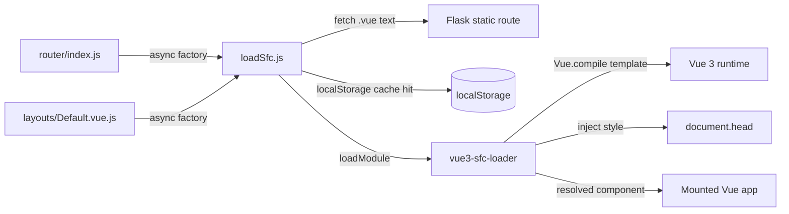

# Requirements

### Overview & Goals
This is **Plan Step 19** (`.junie/plans/project-clarification-and-test-plan.md`, previously Step 15): introduce a runtime **SFC (Single-File-Component) loader** (`vue3-sfc-loader`) and migrate the first, least-interconnected components from today's `.vue.js` template-string/Options-API objects to real `.vue` files (`<template>`/`<script>`/`<style>`), **without introducing a build process** - `.vue` files are parsed/compiled directly in the user's browser at runtime; the Raspberry Pi keeps serving them unchanged as static assets, exactly like today's `.vue.js` files.

Goal: after this step, `About.vue`, `AquapiLoginForm.vue`, and `AquapiLoginDialog.vue` exist as genuine SFCs, are loaded lazily on demand via a small `loadSfc(path)` wrapper, and behave exactly as their `.vue.js` predecessors did - proving out the SFC pipeline before the larger Step 20 migration (`Home`, `Config`, `Settings`, layouts).

### Scope
**In Scope**
- Adding `vue3-sfc-loader` as a new browser-global library under `aquaPi/static/libs/`.
- Implementing a `loadSfc(path)` wrapper module that configures `loadModule()` (module cache seeded with `Vue`, `fetch`-based `getFile`, automatic `<style>` injection into `<head>`, `localStorage`-backed compile cache).
- Migrating exactly 3 components to `.vue` SFCs: `pages/About.vue`, `components/auth/AquapiLoginForm.vue`, `components/auth/AquapiLoginDialog.vue`.
- Wiring these 3 components into the router/nav-drawer as **lazy-loaded async components** (loaded only when their route/dialog is actually used).

**Out of Scope** (explicitly deferred to later plan steps)
- Migrating `Home`, `Config`, `Settings`, or either layout (`Default`/`Auth`) - that is Step 20.
- Migrating Vuex store modules to any new registration pattern (already done in Step 18; unaffected here).
- Any new feature work or visual redesign of the migrated components.

### Functional Requirements
- Navigating to `/login` and `/about` still renders the login form and about page exactly as before, now loaded as SFCs on first visit.
- The `AquapiLoginDialog` (used from the nav drawer) still opens/closes and embeds `AquapiLoginForm` exactly as before.
- Login (success and validation-error paths) and the About page's donate `$alert` continue to work unchanged.
- The 3 old `.vue.js` files are deleted; nothing in the codebase still imports them.
- Loading a not-yet-migrated page (`/`, `/config`, `/settings`) is unaffected in behavior or noticeably in load time.

# Technical Design

### Current Implementation
- `pages/About.vue.js`: a plain JS object (`{template: '...', methods: {...}}`) imported statically by `router/index.js` (`import {About} from '../pages/About.vue.js'`) and used directly as the route's `default` component.
- `components/auth/AquapiLoginForm.vue.js`: similar object, additionally self-registers globally via `registerGlobalComponent('AquapiLoginForm', ...)` (Step 18) since it's referenced both as a route component and, via its tag `<aquapi-login-form>`, inside `AquapiLoginDialog`'s template.
- `components/auth/AquapiLoginDialog.vue.js`: imports `AquapiLoginForm` statically and registers it locally via `components: {AquapiLoginForm}`; used only from `layouts/Default.vue.js`'s nav-drawer login entry point (not routed).
- `router/index.js`: routes hold direct object references to page components (`components: {default: Home}` etc.) - no async/lazy component pattern is used anywhere today.
- `aquaPi/static/libs/` holds only pre-built global browser bundles (`vue.3.5.40.global.js` etc.); `vue.3.5.40.global.js` is the **full build including the runtime template compiler** (confirmed: it defines a working `Vue.compile` and supports the `template:` string option used throughout the app), which `vue3-sfc-loader` needs to compile `<template>` blocks parsed out of `.vue` files.
- No dynamic-import/lazy-loading pattern exists yet anywhere in the SPA; all component modules are statically `import`ed at the top of their consumers.

### Key Decisions
- **SFC compile strategy** (per master plan `project-clarification-and-test-plan.md`): use `vue3-sfc-loader` to parse/compile `.vue` files entirely client-side in the visitor's browser; the Flask/Pi backend serves `.vue` files unchanged as static assets, exactly like today's `.js` files - no server-side or build-time compilation step is introduced.
- **Loading timing** → **lazy, per route/component** (per user decision): the 3 migrated SFCs are wrapped as async component factories (`() => loadSfc('/static/spa/pages/About.vue')`) at their existing call sites (`router/index.js` route definitions, `AquapiLoginDialog`'s `components:` option) - Vue Router 4 and Vue 3 support plain-promise-returning-function async components natively, so `About`/`AquapiLoginForm`/`AquapiLoginDialog` are only fetched and compiled the first time their route/dialog is actually visited/opened, keeping the app's initial boot cost unchanged.
- **Compile cache** → **enabled via `localStorage`** (per user decision): `loadSfc.js` passes `getCachedModule`/`setCachedModule` options backed by `window.localStorage`, keyed by file path plus a cache-format version constant (bumped manually if the loader/compiler version changes) - avoids re-parsing/re-compiling the same `.vue` file's script/template/style on every repeat visit, which matters most on the low-power Pi Zero 2 target hardware.
- **Style handling**: rely on `vue3-sfc-loader`'s `addStyle` option (inject `<style>` block content as a `<style>` tag into `<head>`) rather than hand-rolling CSS extraction - keeps `.vue` files self-contained and consistent with a normal Vue build pipeline.
- **Migration order**: exactly the 3 components named in the master plan's Step 19 description (`About`, `AquapiLoginForm`, `AquapiLoginDialog`) - chosen because they have the fewest inbound dependencies (no dedicated Vuex module, no EventBus usage, no child components besides each other), making them a safe, low-risk proof of the SFC pipeline before Step 20's larger, more interconnected pages/layouts.

### Proposed Changes
1. **Library**: add `vue3-sfc-loader` as a new browser-global bundle (`aquaPi/static/libs/vue3-sfc-loader.js`) and reference it via a new `<script>` tag in `spa.html.jinja2`, placed after the Vue 3 script tag so it can auto-detect/use `window.Vue`.
2. **`loadSfc.js`** (new module, `aquaPi/static/spa/sfc/loadSfc.js`): thin wrapper around `loadModule(path, options)` with `moduleCache: {vue: Vue}`, a `fetch`-based `getFile(url)`, `addStyle` injecting into `document.head`, and `localStorage`-backed `getCachedModule`/`setCachedModule` keyed by `path + CACHE_VERSION`. Exports a single `loadSfc(path)` function returning a `Promise<Component>`.
3. **Convert 3 components to `.vue` SFCs**: `pages/About.vue`, `components/auth/AquapiLoginForm.vue`, `components/auth/AquapiLoginDialog.vue`, each split into `<template>` (verbatim from the old `template:` string), `<script>` (`export default {...}`, same `data`/`methods`/`props`/`computed`).
4. **Wire up lazy loading**: `router/index.js` replaces the static `About`/`AquapiLoginForm` imports and route bindings with `() => loadSfc(...)` factories for the `about`/`login` routes; `layouts/Default.vue.js`'s nav-drawer login trigger and `AquapiLoginDialog`'s own `components: {AquapiLoginForm}` similarly become async factories.
5. **Delete** the 3 old `.vue.js` files once their replacements are verified working, and remove the now-unused `registerGlobalComponent('AquapiLoginForm', ...)` call (no longer needed since it's referenced via async factory, not global registration).
6. Update `spa.html.jinja2` with the new `<script>` tag for `vue3-sfc-loader`.

### Data Models / Contracts
```js
// aquaPi/static/spa/sfc/loadSfc.js
const CACHE_VERSION = 'v1'

const options = {
  moduleCache: { vue: Vue },
  async getFile(url) {
    const res = await fetch(url)
    if (!res.ok) throw new Error(url + ' ' + res.statusText)
    return await res.text()
  },
  addStyle(textContent) {
    const style = document.createElement('style')
    style.textContent = textContent
    document.head.appendChild(style)
  },
  getCachedModule(key) {
    const raw = window.localStorage.getItem('aquapi.sfc.' + CACHE_VERSION + '.' + key)
    return raw ? JSON.parse(raw) : undefined
  },
  setCachedModule(key, value) {
    window.localStorage.setItem('aquapi.sfc.' + CACHE_VERSION + '.' + key, JSON.stringify(value))
  },
}

export function loadSfc(path) {
  return window['vue3-sfc-loader'].loadModule(path, options)
}
```
```js
// router/index.js (excerpt)
import {loadSfc} from '../sfc/loadSfc.js'
// ...
{ path: '', name: 'login', components: { default: () => loadSfc('/static/spa/components/auth/AquapiLoginForm.vue') } }
{ path: 'about', name: 'about', components: { default: () => loadSfc('/static/spa/pages/About.vue') } }
```

### Components
- `aquaPi/static/spa/sfc/loadSfc.js`: new, the sole integration point with `vue3-sfc-loader`.
- `pages/About.vue`, `components/auth/AquapiLoginForm.vue`, `components/auth/AquapiLoginDialog.vue`: new SFC files, replacing the `.vue.js` files of the same base name (which get deleted).
- `router/index.js`: `about`/`login` route component bindings become async factories calling `loadSfc(...)`.
- `layouts/Default.vue.js`: reference to `AquapiLoginDialog` becomes an async factory.
- `aquaPi/templates/pages/spa.html.jinja2`: new `<script>` tag for `vue3-sfc-loader`.

### Architecture Diagram


### Risks
- **Runtime compile cost / first-load latency**: parsing+compiling a `.vue` file client-side is measurably slower than a plain object literal - mitigated by lazy loading (only the visited route pays the cost) and the `localStorage` compile cache (repeat visits skip re-compilation); will be observed during manual verification and called out if it's noticeably worse on the target hardware.
- **`window['vue3-sfc-loader']` global name / UMD export shape** can vary by build; will be confirmed against the actually-downloaded bundle during implementation and the wrapper adjusted if the global is named differently.
- **`localStorage` cache staleness**: if a cached compiled module doesn't match the current `.vue` source (e.g. after a manual file edit without bumping `CACHE_VERSION`), the stale compiled version would keep loading - mitigated by the explicit `CACHE_VERSION` key prefix that must be bumped whenever the loader/compiler version or caching semantics change; full content-hash-based invalidation is left as a possible future refinement.
- **`AquapiLoginForm` used from two places** (route + `AquapiLoginDialog`): both call sites resolve to the same async factory pattern, and `vue3-sfc-loader`'s own in-memory cache (on top of the `localStorage` cache) de-duplicates fetch/compile within a session.

# Testing

### Validation Approach
This step touches only frontend code (new `.vue` files, a new loader wrapper, router wiring - no Python/backend changes), so validation is manual/browser-based (ideally via the existing headless-browser check-script pattern from Step 18) plus static syntax checks, consistent with the project's established verification approach for frontend-only steps.

### Key Scenarios
- Navigating to `/#/login` (fresh page load, empty cache) fetches and renders `AquapiLoginForm.vue` via `loadSfc`, no console errors; a second visit in the same session loads from the in-memory `vue3-sfc-loader` cache without a network request.
- Navigating to `/#/about` renders `About.vue` correctly, including the `$t(...)` translations and the donate button's `$alert(...)` call.
- Opening the login dialog from the nav drawer (not via the `/login` route) renders `AquapiLoginDialog.vue` embedding the lazily-loaded `AquapiLoginForm.vue`.
- Reloading the browser (clearing in-memory cache but keeping `localStorage`) shows the compile cache being used (verified via `localStorage` keys after the first load).
- Logging in via the migrated form still dispatches `auth/login` and navigates to `home` exactly as before.

### Edge Cases
- A `.vue` file with a syntax error should surface a clear console error from `vue3-sfc-loader` rather than silently failing to render.
- Repeated dialog open/close of `AquapiLoginDialog` should not re-fetch `AquapiLoginForm.vue` from the network each time (session-level in-memory cache).
- Navigating directly to `/#/about` on first app load (deep link, bypassing home) should still correctly lazy-load the SFC.
- Existing, not-yet-migrated pages (`/`, `/config`, `/settings`) must render identically to before - confirms the new loader/library addition doesn't interfere with the untouched `.vue.js` component pipeline.

### Test Changes
- All modified/added `.js` files checked with `node --input-type=module --check` where applicable; `.vue` files verified by actually loading them in the browser since Node can't parse SFC syntax directly.
- No Python touched, so no `pytest` run needed for this step per the agreed testing protocol.

# Delivery Steps

### ✓ Step 1: Add the `vue3-sfc-loader` library and the `loadSfc` wrapper
The app has a working, cached, fetch-based SFC-loading pipeline that is not yet wired into any component.
- Add `vue3-sfc-loader` as a browser-global bundle under `aquaPi/static/libs/` and reference it via a new `<script>` tag in `spa.html.jinja2` (after the Vue 3 script tag).
- Add `aquaPi/static/spa/sfc/loadSfc.js` implementing `loadSfc(path)` with `moduleCache: {vue: Vue}`, `fetch`-based `getFile`, `addStyle` head-injection, and a `localStorage`-backed `compiledCache: {get, set}` (the loader's actual cache hook name, discovered during implementation to differ from the plan's originally assumed `getCachedModule`/`setCachedModule`) keyed by a `CACHE_VERSION` prefix.
- Verified the wrapper in isolation via a headless-browser run against a throwaway test `.vue` file: `loadSfc()` resolves a real component and `localStorage` gets populated with `aquapi.sfc.v1.*` cache entries on first load.

### ✓ Step 2: Migrate `About.vue.js` to `About.vue` and load it lazily from the router
The `/about` route renders the same content as before, now sourced from a real `.vue` SFC loaded on demand.
- Create `aquaPi/static/spa/pages/About.vue` with `<template>` (ported verbatim) and `<script>` (`export default {methods: {donate() {...}}}`).
- Update `router/index.js`'s `about` route to use `components: {default: () => loadSfc('/static/spa/pages/About.vue')}`, removing the static `About` import.
- Delete `pages/About.vue.js`.

### ✓ Step 3: Migrate `AquapiLoginForm.vue.js` and `AquapiLoginDialog.vue.js` to SFCs and load both lazily
Login via the `/login` route and via the nav-drawer dialog both work unchanged, sourced from lazily-loaded SFCs.
- Created `components/auth/AquapiLoginForm.vue` (props, `data`, `usernameRules`/`passwordRules`, `methods.login`/`validate`/`cancelLogin` ported verbatim), removed its `registerGlobalComponent(...)` call and deleted the old `.vue.js` file.
- Created `components/auth/AquapiLoginDialog.vue` with `components: {AquapiLoginForm: Vue.defineAsyncComponent(() => loadSfc(...))}`, and deleted the old `.vue.js` file.
- Updated `router/index.js`'s `login` route (`() => loadSfc(...)` directly, since Vue Router 4 natively supports plain-promise-returning route component factories) and `layouts/Default.vue.js`'s nav-drawer reference to `AquapiLoginDialog` (`Vue.defineAsyncComponent(() => loadSfc(...))`, since a bare factory in a plain `components:` option is NOT auto-async-resolved by Vue 3 the way router components are - discovered and fixed during implementation, see Key Decisions below).
- **Fixed two real implementation-time discoveries** not anticipated by the original plan:
  1. vue3-sfc-loader parses plain `.js`/`.mjs` dependencies with Babel's non-module (`.js`) vs. module (`.mjs`) `sourceType`, so a `.vue` file's `<script>` can't `import` a `.js` file that itself uses `import`/`export` syntax (like `loadSfc.js`). Fixed by exposing `loadSfc` through `moduleCache` (`moduleCache: {vue: Vue, 'sfc/loadSfc': {loadSfc}}`, the same mechanism already used for `vue`), so `AquapiLoginDialog.vue` does `import {loadSfc} from 'sfc/loadSfc'` (a virtual specifier resolved from the cache, never fetched/parsed as a file).
  2. A bare `() => loadSfc(...)` factory only auto-resolves as an async component for Vue Router route components; plain `components: {...}` option entries (the nav-drawer's `AquapiLoginDialog`, and `AquapiLoginDialog`'s own local `AquapiLoginForm`) needed an explicit `Vue.defineAsyncComponent(() => loadSfc(...))` wrapper, otherwise Vue rendered the returned Promise object as literal text (`[object Promise]`) instead of mounting the component.

### ✓ Step 4: Verify the migrated pages/dialog end-to-end and confirm the rest of the app is unaffected
All 3 migrated components behave exactly like their `.vue.js` predecessors, verified against the running app.
- Verified via a headless-browser (Puppeteer) run against the live Flask app with the real login: server-side Flask-Login redirect to `/login` → SPA loads at `/`, `/#/about` renders and the gift-icon `donate()` action correctly shows the `$alert` dialog ("Lob bitte an tkuhn..."), the nav-drawer login icon opens `AquapiLoginDialog` with an embedded, working `AquapiLoginForm`.
- Confirmed the `localStorage` compile cache (`aquapi.sfc.v1.*` keys) gets populated after first load of the SFCs.
- Confirmed `/`, `/config`, `/settings` still render their full content unaffected by the SFC-loader addition.
- The only console errors observed (`window.Vue.component is not a function`, `window.Vue.use is not a function`) come from the pre-existing, already-documented Vue-2-only `vuedraggable`/`vue-masonry-css` UMD plugins (Step 18 known limitation), not from this step's changes.
- All modified/added `.js` files pass `node --input-type=module --check`; temporary check scripts and `node_modules` used for verification were removed afterwards.