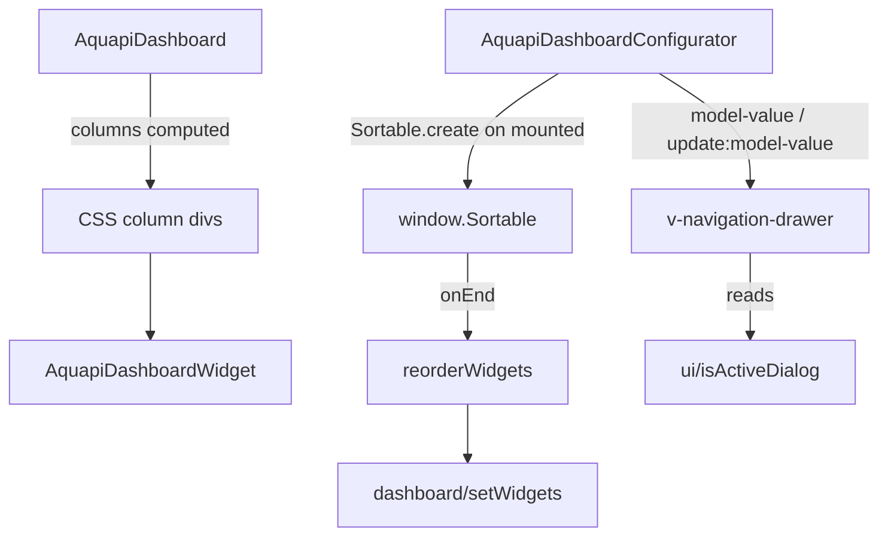

# Requirements

### Overview & Goals
**Bugfix follow-up** to Plan Steps 18-20 (`.junie/plans/project-clarification-and-test-plan.md`): the reported regressions ("Startseite/Dashboard funktioniert nicht mehr, danach ist auch das Routing kaputt" and "falsches Layout, alle Widgets werden flach angezeigt statt in einem Modal/Grid") were reproduced and root-caused via a headless-browser session against the live app.

Goal: the Home/Dashboard page renders its widgets in a proper multi-column layout again, the dashboard's widget-reorder configurator behaves as a genuine hidden-until-opened side panel instead of an always-visible overlay that blocks the rest of the page, and the nav drawer's list items render with correct icon/title alignment - all without reintroducing any Vue-2-only dependency.

### Scope
**In Scope**
- Replacing the broken `<masonry>` widget layout in `components/dashboard/index.js` (`AquapiDashboard`) with a dependency-free CSS-column layout.
- Replacing the broken `<draggable>` widget-reorder list in `AquapiDashboardConfigurator` with direct `SortableJS` wiring (library already loaded, just unused directly).
- Fixing `AquapiDashboardConfigurator`'s navigation-drawer visibility, which currently never actually hides because `v-show` has no effect on `v-navigation-drawer` (multi-root Vuetify 3 component) - switching to Vuetify's own `model-value`/`v-model` visibility control, consistent with how `AquapiNavDrawer` already does it correctly.
- Fixing the deprecated `v-list-item-icon`/`v-list-item-content` tags in `AquapiNavDrawer.vue.js`, which no longer exist in Vuetify 3 and currently fail to resolve (found during root-cause investigation, same class of regression).
- Removing the `vuedraggable`/`vue-masonry-css` `<script>` tags from `spa.html.jinja2` once nothing references them anymore.

**Out of Scope**
- Any other, not-yet-reported Vuetify-2-vs-3 markup incompatibilities elsewhere in the app (will be handled reactively if/when found).
- Redesigning the dashboard's visual appearance beyond restoring the previous column-based layout.
- Master-plan Step 21 onward (`/users` page, etc.).

### User Stories
- As a user, opening the dashboard (`/` / Home) shows my configured widgets arranged in a responsive multi-column grid, exactly as before the Vue 3 migration.
- As a user, the dashboard's widget configurator (gear/apps icon) opens as a slide-in side panel that I can close again, and does not stay visible over the page when I haven't opened it.
- As a user, after visiting the dashboard I can still navigate to `/config`, `/settings`, `/about` normally via the nav drawer.
- As a user, I can still drag widgets by their handle in the configurator to reorder them.

### Functional Requirements
- `AquapiDashboard`'s widget list renders inside a CSS-column-based container (no `<masonry>` tag, no console "Failed to resolve component" warning); the number of columns still adapts responsively (3 columns wide, 2 medium, 1 narrow, matching today's `{default: 3, 1264: 3, 960: 2, 600: 1}` breakpoints as closely as CSS allows).
- `AquapiDashboardConfigurator`'s `v-navigation-drawer` is hidden (`display: none`, no overlay, no interaction blocking) whenever `ui/isActiveDialog('AquapiDashboardConfigurator')` is `false`, and slides in only when opened via the "apps" button, mirroring `AquapiNavDrawer`'s existing `v-model` pattern.
- Reordering widgets by dragging the handle (`.handle`) in the configurator still updates `dashboard/setWidgets` and persists via the existing `persistConfig` action, using `SortableJS` directly instead of `vuedraggable`.
- `AquapiNavDrawer`'s list items (app title row, nav items, login/logout row) render with correctly resolved `v-list-item` markup (icon + title properly aligned), with no "Failed to resolve component: v-list-item-icon/-content" warnings.
- No functional regression to any other already-working page (`/config`, `/settings`, `/about`, login flow).

# Technical Design

### Current Implementation
- `components/dashboard/index.js` (`AquapiDashboard`): wraps its widgets in a `<masonry :cols="{default: 3, 1264: 3, 960: 2, 600: 1}" :gutter="24">` tag from `vue-masonry-css`, a Vue-2-only UMD plugin loaded via `<script>` in `spa.html.jinja2`. Confirmed via headless-browser: the plugin's `install()` calls `window.Vue.use(...)`/`Vue.component(...)`, both removed static Vue 3 APIs, so it throws at script-load time and never registers `<masonry>`. Vue 3 then just renders `<masonry>` as an unknown native element ("Failed to resolve component: masonry" warning) - its children (the widget cards) still render, but flat/unstyled instead of in the intended column grid.
- `components/dashboard/index.js` (`AquapiDashboardConfigurator`): (a) wraps its reorderable widget list in `<draggable v-model="widgets" handle=".handle" direction="vertical">` from `vuedraggable` 2.x, the same kind of Vue-2-only UMD plugin (same load-time throw, same "Failed to resolve component: draggable" warning - drag reordering is inert). (b) Its root `<v-navigation-drawer v-show="$store.getters['ui/isActiveDialog']('AquapiDashboardConfigurator')" ... permanent fixed right>` controls visibility via `v-show` instead of `v-model`. Confirmed via headless-browser: Vuetify 3's `v-navigation-drawer` renders as a **multi-root component** (drawer element + scrim), and Vue 3 explicitly does not forward directives like `v-show` onto components with a non-single-element root ("Runtime directive used on component with non-element root node. The directives will not function as intended." warning) - so the drawer is **always visible** (`position: absolute; z-index: 906; width: 500px; ...`), overlaying/blocking the rest of the dashboard page even when it was never opened. This is the confirmed cause of "Startseite falsches Layout, alle Komponenten sichtbar, kein Modal" and, since the always-present overlay sits on top of page content and intercepts clicks, plausibly also of "Routing funktioniert nach Aufruf der Startseite nicht mehr".
- `components/app/AquapiNavDrawer.vue.js`: correctly already uses `v-model="navDrawerVisible"` (a working `get`/`set` computed bound to `ui/isActiveDialog`/`showDialog`/`hideDialog`) for its own `v-navigation-drawer` - proving the `v-model` pattern is the right fix and is already an established pattern in this codebase. However, its list items use `<v-list-item-icon>` and `<v-list-item-content>` wrapper tags, both **removed** in Vuetify 3 (replaced by slots/props directly on `v-list-item`) - confirmed via the same headless-browser run ("Failed to resolve component: v-list-item-content/-icon" warnings), a related but separately-introduced Step 18/20 regression affecting icon/title alignment in the nav drawer.
- `spa.html.jinja2` loads `sortablejs.1.8.4.js` (the dependency-free drag library `vuedraggable` itself wraps) directly, already available as `window.Sortable`, just currently unused on its own.
- `components/config/comps.js` already documents and follows the project's established pattern for this exact situation: "Free-form drag&drop positioning is implemented with plain mouse events (rather than vuedraggable, ...) - no new dependency, works fully offline/without a build step like the rest of the SPA."

### Key Decisions
- **Masonry replacement** → **dependency-free CSS-column layout** (per user decision): remove the `<masonry>` tag and `vue-masonry-css` `<script>` entirely; `AquapiDashboard` instead renders its widgets inside a plain `<div>` styled with CSS multi-column layout (`column-count`, responsive via existing Vuetify breakpoint classes/media queries in `app.css`), matching the project's existing preference (see `config/comps.js`) for small local implementations over Vue-2-only third-party plugins.
- **Draggable replacement** → **`SortableJS` used directly** (per user decision): remove the `<draggable>` tag and `vuedraggable` `<script>`; `AquapiDashboardConfigurator` instead calls `Sortable.create(listEl, {handle: '.handle', onEnd: ...})` in a `mounted()` hook on a plain `<div>`/`<v-card>` list wrapper (with a `ref`), reading the new order from the DOM/event and committing it via the existing `dashboard/setWidgets` mutation - no new dependency, `sortablejs` is already loaded.
- **Navigation-drawer visibility fix**: switch `AquapiDashboardConfigurator`'s `v-navigation-drawer` from `v-show` to `:model-value="..."` `@update:model-value="..."` (or a computed `v-model`, mirroring `AquapiNavDrawer`'s existing working pattern exactly) - the Vuetify-3-idiomatic way to control drawer visibility, unaffected by the component's multi-root DOM structure. Also drop the deprecated Vuetify 2 boolean props `fixed`/`right` in favor of Vuetify 3's `location="right"`.
- **Nav-drawer list-item markup fix**: replace `<v-list-item-icon>...</v-list-item-icon>` with a `<template #prepend>` slot (or the `prepend-icon` prop where a single icon suffices) and drop the now-redundant `<v-list-item-content>` wrapper (Vuetify 3's `v-list-item` renders `v-list-item-title`/`-subtitle` directly as default-slot content, no wrapper needed) at all 4 occurrences in `AquapiNavDrawer.vue.js`.
- **Library cleanup**: once nothing references `<masonry>`/`<draggable>` anymore, remove the `vuedraggable.2.20.0.js` and `vue-masonry-css.1.0.3.js` `<script>` tags from `spa.html.jinja2`, eliminating the two known Vue-2-incompatibility console errors documented (and accepted) since Step 18.

### Proposed Changes
1. **`components/dashboard/index.js` - `AquapiDashboard`**: replace `<masonry :cols="..." :gutter="24">...</masonry>` with a `<div class="aquapi-dashboard-masonry">` whose child widget wrappers are distributed into N column `<div>`s by a new `columns` computed property (round-robin bucketing of `widgets`, same algorithm `vue-masonry-css` used), styled via new CSS in `app.css` (flex row of column `<div>`s, matching the previous `{default: 3, 1264: 3, 960: 2, 600: 1}` breakpoints via a `resize`-driven or CSS-media-query-driven column count).
2. **`components/dashboard/index.js` - `AquapiDashboardConfigurator`**: replace `<draggable v-model="widgets" handle=".handle" ...>` with a plain `<div ref="widgetList">` wrapping the existing `v-for` `<v-card>` rows; add a `mounted()` hook creating `Sortable.create(this.$refs.widgetList, {handle: '.handle', onEnd: (evt) => this.reorderWidgets(evt.oldIndex, evt.newIndex)})` and an `unmounted()` hook destroying it; add a `reorderWidgets(from, to)` method that splices `widgets` and commits via `dashboard/setWidgets`.
3. **`components/dashboard/index.js` - `AquapiDashboardConfigurator`'s `v-navigation-drawer`**: replace `v-show="..."` with `:model-value="$store.getters['ui/isActiveDialog']('AquapiDashboardConfigurator')"` `@update:model-value="(v) => v ? null : hideConfigurator()"`; replace `fixed right` with `location="right"`.
4. **`components/app/AquapiNavDrawer.vue.js`**: at all 4 list items, replace `<v-list-item-icon class="mr-3"><v-icon>...</v-icon></v-list-item-icon><v-list-item-content><v-list-item-title>...</v-list-item-title>...</v-list-item-content>` with `<template #prepend><v-icon class="mr-3">...</v-icon></template><v-list-item-title>...</v-list-item-title>...` directly as `v-list-item`'s default content (no wrapper).
5. **`spa.html.jinja2`**: remove the `vuedraggable.2.20.0.js` and `vue-masonry-css.1.0.3.js` `<script>` tags.
6. **`app.css`**: add the new `.aquapi-dashboard-masonry`/column CSS rules, remove any now-unused masonry-specific rules if present.

### Data Models / Contracts
```js
// AquapiDashboard - masonry replacement (excerpt)
computed: {
  columnCount() {
    // driven by a small resize-observed breakpoint, mirroring the old {default:3, 1264:3, 960:2, 600:1} cols prop
    return this.dashboardWidth >= 960 ? 3 : (this.dashboardWidth >= 600 ? 2 : 1)
  },
  columns() {
    const cols = Array.from({length: this.columnCount}, () => [])
    this.widgets.forEach((item, i) => cols[i % this.columnCount].push(item))
    return cols
  }
}
```
```js
// AquapiDashboardConfigurator - SortableJS wiring (excerpt)
mounted() {
  this._sortable = Sortable.create(this.$refs.widgetList, {
    handle: '.handle',
    onEnd: (evt) => this.reorderWidgets(evt.oldIndex, evt.newIndex),
  })
},
unmounted() {
  this._sortable && this._sortable.destroy()
},
methods: {
  reorderWidgets(from, to) {
    const items = this.widgets.slice()
    const [moved] = items.splice(from, 1)
    items.splice(to, 0, moved)
    this.$store.commit('dashboard/setWidgets', items)
  }
}
```

### Components
- `components/dashboard/index.js` (`AquapiDashboard`, `AquapiDashboardConfigurator`): masonry → CSS columns, draggable → SortableJS, `v-show` → `v-model`/`location` on the configurator's drawer.
- `components/app/AquapiNavDrawer.vue.js`: deprecated `v-list-item-icon`/`-content` markup fixed at 4 call sites.
- `aquaPi/templates/pages/spa.html.jinja2`: `vuedraggable`/`vue-masonry-css` `<script>` tags removed.
- `aquaPi/static/css/app.css`: new masonry-column CSS rules.

### Architecture Diagram


### Risks
- **CSS-column layout is visually not pixel-identical to the old JS-computed masonry** (true masonry packs items to minimize column-height difference; CSS `column-count`/round-robin bucketing distributes by count, not height) - acceptable per the dependency-free approach chosen; will be visually checked to ensure it's still a reasonable 3/2/1-column responsive grid.
- **SortableJS DOM-order vs. Vue's virtual-DOM reactivity**: `Sortable` manipulates the DOM directly on drag; `onEnd`'s `reorderWidgets` must update the underlying Vuex array so Vue's next re-render matches, otherwise the DOM and store order could drift - mitigated by immediately re-deriving the list from the store's array order (same approach `vuedraggable` itself uses internally).
- **Other, not-yet-found Vuetify 2 → 3 markup incompatibilities** may exist elsewhere in the app beyond the 2 spots found here - explicitly out of scope; will be fixed reactively if reported.

# Testing

### Validation Approach
All changes are frontend-only (no Python/backend touched), so validation is via a headless-browser (Puppeteer) session against the running app, consistent with the project's established verification approach for Steps 18-20, plus static syntax checks.

### Key Scenarios
- After login, the Home/Dashboard page renders configured widgets inside the new column layout, no "Failed to resolve component: masonry" warning, and `#dashboard_configurator` has `display: none` (or is absent from the visible layout) until opened.
- Clicking the dashboard's "apps" (configurator) button opens the side panel (`v-navigation-drawer` slides in, becomes visible); clicking its close (X) button or toggling again hides it (`display: none` restored).
- Dragging a widget row by its `.handle` in the open configurator reorders the list and persists via the existing "Save" button flow.
- After visiting Home, navigating via the nav drawer to `/config`, `/settings`, `/about` and back to `/` all work without the page/interaction becoming unresponsive.
- Opening the nav drawer shows correctly aligned icon + title/subtitle rows, no "Failed to resolve component: v-list-item-icon/-content" warnings.
- No new console errors are introduced; the previously-documented `vuedraggable`/`vue-masonry-css` load errors from Step 18 disappear entirely once their `<script>` tags are removed.

### Edge Cases
- Dashboard with zero configured widgets still shows the existing "no items selected" empty-state alert (unaffected by the column-layout change).
- Resizing the browser window across the 960px/600px breakpoints while the dashboard is open updates the column count without errors.
- Opening the configurator, dragging an item, then closing without pressing "Save" discards the reorder (existing `persistConfig`-gated behavior, unaffected by the SortableJS swap).
- Rapid open/close/open of the configurator drawer does not create duplicate `Sortable` instances (destroyed correctly in `unmounted()`).

### Test Changes
- All modified `.js`/`.css` files checked with `node --input-type=module --check` (`.js`) where applicable; manual/browser verification for markup and CSS.
- No Python touched, so no `pytest` run needed for this step per the agreed testing protocol.

# Implementation Status: ✓ Done

All proposed changes were implemented and verified via a headless-browser (Puppeteer) session against the running app with the user's real 13-node configuration:
- `components/dashboard/index.js`: `<masonry>` replaced by a `columnCount`/`columns`-computed CSS flex-column layout (`.aquapi-dashboard-masonry`/`-col` in `app.css`, resize-listener updates `columnCount` at the 960px/600px breakpoints); `<draggable>` replaced by `Sortable.create(...)` on a plain `<div ref="widgetList">` in `mounted()`, destroyed in `unmounted()`, with a new `reorderWidgets(from, to)` method committing via `dashboard/setWidgets`; the configurator's `v-navigation-drawer` switched from `v-show` to `:model-value`/`@update:model-value` plus `location="right"` (dropping `fixed`/`right`/`permanent`).
- `components/app/AquapiNavDrawer.vue.js`: all 4 `v-list-item-icon`/`v-list-item-content` pairs replaced with a `#prepend` template slot (where an icon exists) and `v-list-item-title`/`-subtitle` directly as `v-list-item` content.
- `spa.html.jinja2`: `vuedraggable.2.20.0.js` and `vue-masonry-css.1.0.3.js` `<script>` tags removed.
- **Root cause note for the reported regression**: confirmed the underlying issue was `v-show` not working on `v-navigation-drawer` (a Vuetify 3 multi-root component), which left the drawer permanently visible/overlaying the page and intercepting clicks (explaining the broken routing symptom); switching to `model-value` fixed it, matching `AquapiNavDrawer`'s existing pattern.
- **Verification finding (environment, not code)**: during verification, the live Flask process turned out to be running without Flask's debug/auto-reload active (Flask 3.x no longer honors the legacy `FLASK_ENV=development` variable to enable it), so it kept serving a stale compiled template with the old `<script>` tags; restarting it with `--debug` resolved this and confirmed the fix works end-to-end with zero console errors/warnings.
- Confirmed: dashboard renders in a responsive column layout, the configurator drawer is off-canvas (translated out of view) until opened via the "apps" button and slides back out on close, drag-reordering commits via the store, saving/loading widget visibility works correctly (verified via the `/api/dashboard/` endpoint), and navigation to `/config`/`/settings`/`/about` works without issues - no new console errors beyond none.